# 機械学習に必要な数学の基礎

この章では、ディープラーニングを含めた機械学習に必要な微分、線形代数、統計の3つについて、よく使う部分を完結に紹介します。

## 微分

微分は高校で習いますが、社会で使うことはほとんどなく、微分は何に使うのかと不明確なまま終わってしまっている人も少なくないだろう。機械学習においては**パラメータ更新**の際に大きなカギとなる考え方であり、その理由について最初に知ってから、数式を理解していこう。

### 微分はどこで使われているか

「微分は何に使えるか」をここでは考えることにしよう。微分が何に使えるのかの質問の前に、**微分は何が求まるのか**をまず考えよう。高校の時には微分では何が求まると習ったかというと、その答えは**接線の傾き**である。数値も交えて具体的に見ていこう。

この図の関数において、$a$ の点における接線の傾きというのは赤い直線の傾きを指し、例えば、傾きが+3のようになっている。+3という値は例ですが、右肩上がりな直線の傾きは正の値になります。

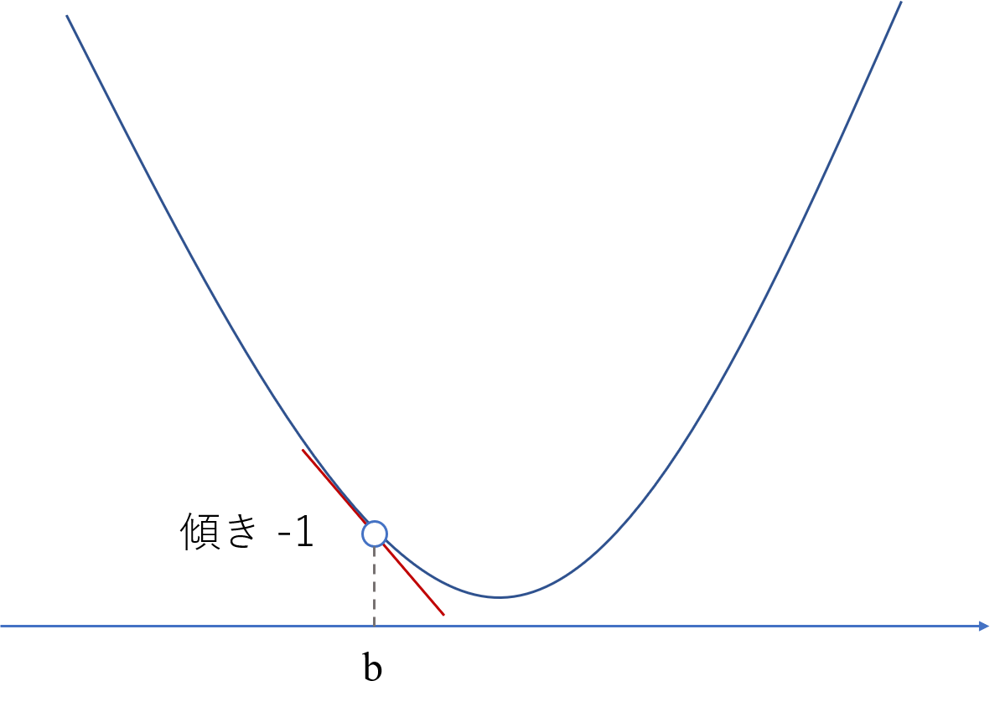

そして、この $b$ の点においては、接線の傾きは右肩下がりであるため、接戦の傾きは負の値であり、傾き-1のようになっている。微分では、この各点における「+3」や「-1」といった傾きを求めることができます。

それでは、本題に戻りましょう。この各点の接戦の傾きが求まると何に使えるのでしょうか。結局、傾きが求まると聞いたところで、使い道が浮かばないのではないでしょうか。

機械学習を使う場合、できるだけ真の値に近い良い予測値を得たいと思っています。学習の際には教師データ $t$ に対して、その予測値 $y$ がなるべく近い値であることが望まれます。そのために、その差分である $t-y$ が小さくなることが望ましいといえます。厳密には、$t-y$ を小さくしたいと考えれば、$y\rightarrow\infty$ とすれば $t-y$ は小さくなりますがそういう話ではなく、$t$ と $y$ の差を小さくしたいため、$|t-y|$ や $(t-y)^{2}$ が小さくなることが望ましいと考えられます。設定としては、$|t-y|$ でも良いのですが、$(t-y)^{2}$ の方が、数学的に取り扱いがしやすく、一般的にこちらが採用されます。この $(t-y)^2$ のことを**二乗誤差**と呼び、機械学習では、この二乗誤差を最も小さくできるように調整したいということがゴールとなります。

そして、二乗誤差が最小となる点を求めたいと考え、その点での接線の傾きは正の値になるでしょうか。それとも、負の値になるでしょうか。答えはどちらでもなく、図の通り、誤差が最小となる点では、**接線の傾きが0**となります。つまり、接線の傾きを用いることで、**ある関数における最小（もしくは最大）となる点を求めることができる**と考えられるわけです。これが微分を学ぶ大きなモチベーションとなっています。コストを最小化したいや売り上げを最大化したいという要望は、ビジネスを含めたありとあらゆる現場で求められる課題設定であり、これらの最適な点を求めるために活躍するツールが微分である。そう考えると、微分を学ぶモチベーションが大きく湧いたのではないでしょうか。

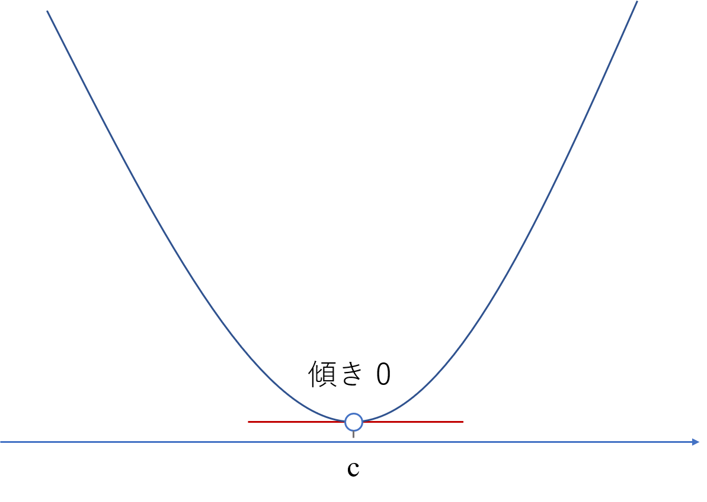

### 2点間を通る直線の傾き

それでは、微分の原理を理解していくために、まずは中学校で習った下図に示す2点間を通る直線の傾き $a$ を求めてみましょう。

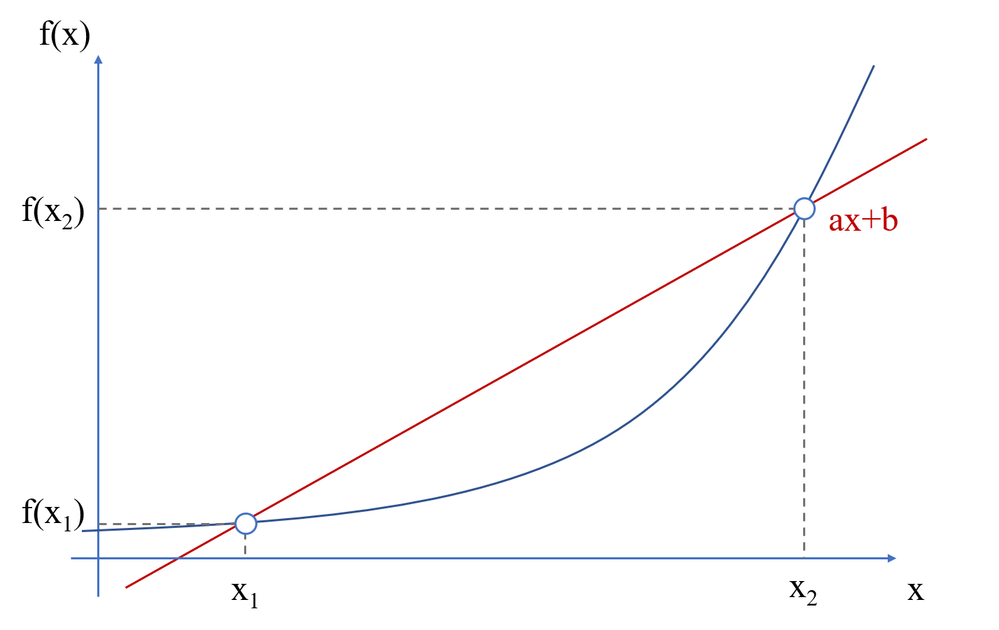
$$
傾きa = \dfrac{f(x)の変化量}{xの変化量}
$$
中学校の時にならったこの考え方おり
$$
a = \dfrac{f(x_{2}) - f(x_{1})}{x_{2}-x_{1}}
$$
と求まります。懐かしいなと思い出してもらえる程度で大丈夫です。これだけの話ですが、これが意外と微分の考え方の大半を占めています。

### 1点での接線の傾き

それでは、中学校で習った内容からさらに接線の傾きまで求められるように考えていきましょう。そのためには、**極限**を知っておく必要があるため紹介します。極限とは、$\lim$ の下に書いた条件に値を近づけていく考え方です。例えば、
$$
\displaystyle \lim _{x\rightarrow 0}3x=3\times 0=0
$$
のような計算です。一見、$x=0$を代入しただけにしか見えないかも知れませんが、点の**動き**を表現したいときに有効な手段であり、こちらが微分でも登場します。

それでは、次の問題として、下図のある点 $x$ における接線の傾き$a$を求めていきましょう。今回は2点ではない、ある1点での接線の傾きです。

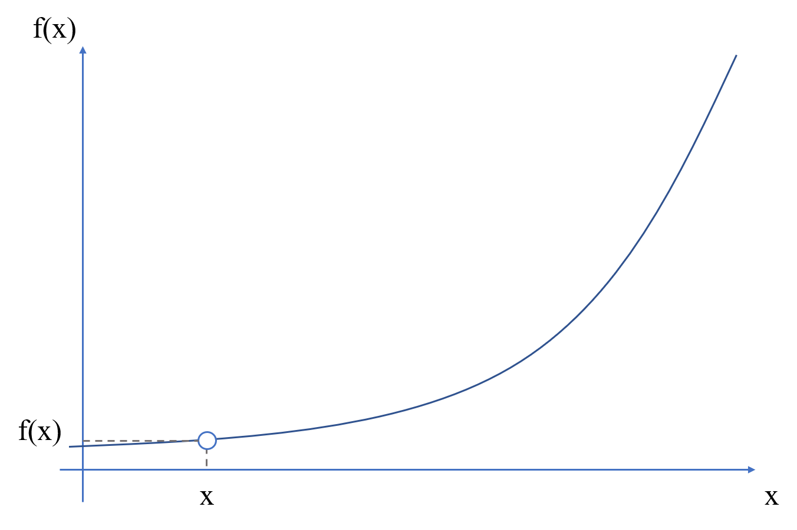

さて、ここで問題が生じないでしょうか。接線の傾きを求めようにも先ほどまでの知識では1点だけでは傾きを求めることができません。そこで、さきほど考えた2点を通る直線と極限を組み合わせて、突破できないか考えてみましょう。

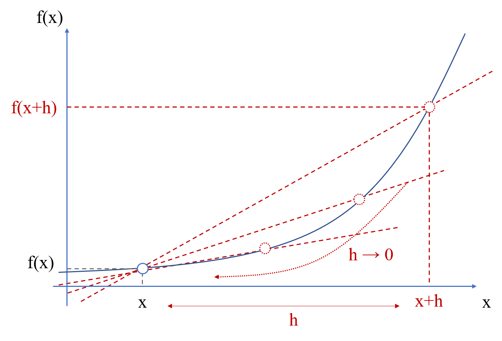

$x$ から $h$ だけ離れた点 $x+h$ を考え、この2点を通る直線の傾きを求めることとします。これでは先ほどまでの2点間を通る直線の傾きと変わらないのですが、$h \rightarrow 0$ のようにすれば、理論上2点が1点となり、1点での接線として考えることができ、直線の傾きは
$$
\begin{aligned}
a &=\lim _{h\rightarrow 0}\dfrac {f\left( x+h\right) -f\left( x\right) }{\left( x+h\right) -x}\\
&=\lim _{h\rightarrow 0}\dfrac {f\left( x+h\right) -f\left( x\right) }{h}\\
 &=\lim _{h\rightarrow 0}\dfrac {f\left( x+h\right) -f\left( x\right) }{h}\\
\end{aligned}
$$
となります。この式が一般的に微分という言葉で認識されていることが多いですが、厳密には**導関数**と呼び、$f'(x)$ で表されます。導関数を求めることを**微分する**といいます。また、記号の使い方として、
$$
(\cdot)' = \dfrac{d}{dx}(\cdot)
$$
のように、どちらも同じです。今後は主に右辺の書き方が多くなってきて複雑に見えるかもしれませんが、本日的には難しいものではありません。このように、中学校までに習った数学と極限の考え方を組み合わせるだけで微分の基本を理解することができました。

### 微分の公式

微分にはいくつか覚えておくと便利な公式があります。特に、機械学習を勉強し始める最初の段階では、まず以下の3つの公式だけである程度計算をスムーズに進めることができます。
$$
\begin{aligned}
\left( 1\right) ^{'}&=0\\
\left( x\right) ^{'}&=1\\
\left( x^{2}\right) ^{'}&=2x
\end{aligned}
$$
これらの微分の公式をこれからよく使うため、暗記しておきましょう。これらは公式として覚えてしまえばよいのですが、ここでは勉強もかねてこの公式を導いてみましょう。数式に対して、あまり余裕がない段階であれば公式だけ覚えて読み飛ばしていただいても構いません。

まずは、$f(x)=1$のときを考えましょう。$f(x)=1$より、$f(x+h)=1$となります。この考え方に多少癖がありますが、考え方のヒントとしては $f(x)$のときに $x$ となっている箇所が $f(x+h)$ のときに $x+h$ へと変わります。今回は $f(x)=1$ より、$x$ が出てこなかったため、$f(x+h)$ も何も変わらず 1 と考えられるわけです。さて、導関数の計算を行うと、
$$
\begin{aligned}
f'(x)&=\left( 1\right)'\\
&=\lim _{h\rightarrow 0}\dfrac {f\left( x+h\right) -f\left( x\right) }{h}\\
&=\lim _{h\rightarrow 0}\dfrac {1-1}{h} \\
&=\lim _{h\rightarrow 0}\dfrac {0}{h}\\
&=\lim _{x\rightarrow 0}0\\
&=0
\end{aligned}
$$
が得られました。

つぎに、$f(x)=x$ のときを考えてみましょう。$f(x+h) = x+h$ となり、
$$
\begin{aligned}
f'\left( x\right) &=\left( x\right)'\\
&=\lim _{h\rightarrow 0}\dfrac {f\left( x+h\right) -f\left( x\right) }{h}\\
&=\lim _{h\rightarrow 0}\dfrac {\left( x+h\right) -x}{h}\\
&=\lim _{h\rightarrow 0}\dfrac {h}{h}\\
&=\lim _{h\rightarrow 0}1\\
&=1\end
{aligned}
$$
が得られました。

最後に、$f(x) = x^{2}$ の場合、$f(x+h) = (x+h)^{2}$ となります。よくある間違いとして、$f(x+h) = x^{2} + h$ や $f(x+h) = x^{2} + h^{2}$ のように考えてしまう人を見かけますが、$f(x) = (x)^{2}$ と考えると、$x$ の部分が $x+h$ に代わるため、$f(x+h) = (x+h)^{2}$ です。このとき、
$$
\begin{aligned}
f\left( x\right) &=\left( x^{2}\right)'\\
&=\lim_{h\rightarrow 0}\dfrac {f{\left( x+h\right) }-f\left( x\right) }{h}\\
&=\lim _{h\rightarrow 0}\dfrac {\left( x+h\right) ^{2}-x^{2}}{h}\\
&=\lim _{h\rightarrow 0}\dfrac {\left( x^{2}+2xh+h^{2}\right) -x^{2}}{h}\\
&=\lim _{h\rightarrow 0}\dfrac {2xh+h^{2}}{h}\\
&=\lim _{h\rightarrow 0}\dfrac {\left( 2x+h\right) h}{h}\\
&=\lim _{h\rightarrow 0}\ (2x + h)\\
&=2x
\end{aligned}
$$
が得られ、3つの公式を導くことができました。

それでは、次の２つの例題を考えながら、具体的な微分の計算に慣れていきましょう。
$$
\begin{aligned}
( 3x^{2})'&=3\times (x^{2})'\\
&=3\times 2x\\
&=6x
\end{aligned}
$$
この $(3x^{2})' = 3 \times (x^{2})'$ の部分に注目してください。微分では、定数項は微分の演算の外側に出すことができます。また、次の例題でも新しい特性があります。
$$
\begin{aligned}
\left( 3x^{2}+4\right)'&=\left( 3x^{2}\right)'+\left( 4\right)'\\
&=3\times \left( x^{2}\right)'+4\times \left( 1\right)'\\
&=3\times 2x+4\times 0\\
&=6x
\end{aligned}
$$
この例題では、$\left( 3x^{2}+4\right)'=\left( 3x^{2}\right)'+\left( 4\right)'$ のように、全体の和をとった後に微分の演算を行っても、それぞれで微分の演算を行った後に和の計算をしても同じとなっています。これは微分の**線形性**と呼ばれる性質であり、気になった方は調べてみてください。ポイントとしては、定数項は演算の外に出すことができて、それぞれの項を微分した後に和をとっても良いということです。この性質は計算を楽にできるところに大きく貢献してくれます。

### 合成関数の微分

機械学習のアルゴリズムで登場する関数は複雑なものも多く、その結果、微分の計算も複雑になりがちです。具体的には、
$$
\left\{ (3x + 4)^{2} \right\}'
$$
のように、$3x+4$ の内側の部分と $(\cdot)^{2}$ の外側の部分で構成されているような場合もあり、展開してからそれぞれ微分を計算してもよいのですが、これが3乗や4乗となってくると現実的ではなくなってこないでしょうか。この時に役に立つ考え方が**合成関数の微分**です。

まず内側の関数を $u = (3x+4)$ とおくと、
$$
\left\{ (3x + 4)^{2} \right\}' = (u^{2})'
$$
とします。ここで、$(\cdot)'$ をもう少し厳密に考える必要が出てきます。いまは、$x$ と $u$ の2つの変数が登場しており、$(\cdot)'$ では、$x$ で微分しているのか $u$ で微分しているのかの区別がつきません。そこで、多少複雑に見えますが、微分する変数を厳密に記述すると、
$$
\begin{aligned}
\left\{ (3x + 4)^{2} \right\}' &= \dfrac{d}{dx} \left\{ (3x + 4)^{2} \right\} \\
&= \dfrac{d}{dx} (u^2) \\
&=  \dfrac{d}{dx} f(u) \\
\end{aligned}
$$
となり、$u$ の関数 $f(u) = u^{2}$ に対して、$x$ で微分してしまっていることがわかります。そこで、
$$
\begin{aligned}
\dfrac{df(u)}{dx} = \dfrac{du}{dx} \dfrac{df(u)}{du}
\end{aligned}
$$
のように右辺と左辺は分数として約分してしまえば同じであるといった考え方を適用することができます。つまり、合成関数の計算は内側の微分と外側の微分をそれぞれ行い、その結果を掛け合わせれ良いわけです。それぞれの微分の計算は
$$
\begin{aligned}
 \dfrac{du}{dx} &= \dfrac{d}{dx} (3x+4) = 3 \\
 \dfrac{df(u)}{du} &= \dfrac{d}{du} u^{2} = 2u \\
\end{aligned}
$$
となります。これより、
$$
\begin{aligned}
\dfrac{df(u)}{dx} &= \dfrac{du}{dx} \dfrac{df(u)}{du} \\
 &= 3 \times 2u \\
 &= 3 \times 2(3x+4) \\
 &= 6(3x+4)
\end{aligned}
$$
が得られます。数式こそ多少複雑に見えますが、内側と外側をそれぞれ微分して掛け合わせるだけであるため、実際の計算は慣れると簡単に行えます。この合成関数の微分を使用する場面が何度も登場するため、この計算方法をしっかりと覚えておきましょう。

### 偏微分

微分最後のトピックとして、**偏微分**を紹介します。偏微分は多変数関数の微分です。機械学習では、1つの入力変数 $x$ から出力変数 $y$ を予測するケースは稀であり、基本的には、複数の入力変数 $x_{1}$, $x_{2}$, $\ldots$, $x_{M}$ を用いて出力変数 $y$ を予測します。例えば、家賃を予測する場合、部屋の広さだけで予測するよりも、駅からの距離や犯罪発生率などを考慮した方が予測の性能は高まりそうだと考えられます。多変数 $x_{1}$, $x_{2}$, $\ldots$, $x_{M}$ を考慮した多変数関数 $f(x_{1}, x_{2}, \ldots, x_{M})$ では、各変数で微分することを偏微分と呼び、
$$
\dfrac{\partial}{\partial x_{m}} f(x_{1}, x_{2}, \ldots, x_{M})
$$
のように表します。大雑把には、$d$ が $\partial$ に変わっただけです。しかも、計算方法は至って単純であり、$\dfrac{\partial}{\partial x_{m}} $の場合は $x_{m}$ 以外は定数と考えて、$x_{m}$ のみ着目して微分を行います。

難しい理論はさておき、例題で具体的な計算の流れを確認していきましょう。
$$
\begin{aligned}
\dfrac {\partial }{\partial x_{1}}\left( 3x_{1}+4x_{2}\right) &=\dfrac {\partial }{\partial x_{1}}\left( 3x_{1}\right) +\dfrac {\partial }{\partial x_{1}}\left( 4x_{2}\right) \\
&=3\times \dfrac {\partial }{\partial x_{1}}\left( x_{1}\right) +4x_{2}\times \dfrac {\partial }{\partial x_{1}}\left( 1\right) \\
&=3\times 1+4x_{2}\times 0\\
&= 3
\end{aligned}
$$
基本的には微分と同じ線形性の性質が適用できます。あとは、今回のケースでは、$x_{1}$ にだけ着目するため、$x_{2}$ ですら定数として扱うことを把握しておけば上記の計算の流れが理解できるはずです。これが偏微分であり、参考書にはここからさらに全微分の話に入っていくことが多いですが、ひとまずここまでの計算の方法を理解しておけば、この後の計算は理解することができるはずです。

## 線形代数

### 線形代数は何に役立つのか

理系の大学に進んだ方にとっては最初の一般教養として受講する**線形代数**です。ベクトル、行列、ランク、逆行列などなど、授業で習いはするものの、どのような場面で役に立つのか見えないまま試験対策だけして過ぎ去った記憶があるのではないでしょうか。もちろん筆者もそのうちの一人です。

さて、微分と同様に理論を学ぶ前に、これから学ぶ線形代数という学問がみなさんにとってどのようなメリットをもたらしてくれるかを考えましょう。$x_{1}$ や $x_{2}$ のように機械学習の中では、似たような複数の変数が登場してきます。また、これらすべてを細々と書いていくのは面倒ですし、間違えやすくもなります。そこで、同じような演算が適用されるものに関しては、まとめて扱いましょうという提案があることが至極当然だと思います。それが線形代数です。線形代数の演算を身に着けることによって、ひとつひとつ書かないといけなかった式を非常にシンプルに取り扱うことができます。人間が楽をするための学問であるため、ぜひ身に着けていきましょう。

### スカラー、ベクトル、行列、テンソル

線形代数を学ぶ上で一番最初に絶対に抑えておくべきことが**スカラー**、**ベクトル**、**行列**、**テンソル**の4つです。

スカラーは、1つの値もしくは変数のことである。例えば、
$$
x, \ y,\  M,\  N
$$
のようなものです。スカラーを単体で説明することは難しいため、次のベクトルと比較するとわかりやすいです。

ベクトルは、複数のスカラーを縦方向（もしくは横方向）に集めたものであり、
$$
\boldsymbol{x}=\begin{bmatrix}
x_{1} \\
x_{2} \\
x_{3}
\end{bmatrix}, \
\boldsymbol{y}=\begin{bmatrix}
y_{1} \\
y_{2} \\
\vdots \\
y_{N}
\end{bmatrix}
$$
ように表します。ベクトルでは太文字としており、スカラーかベクトルかを一目で区別できるようにしています。ベクトルを縦方向に定義するか横方向に定義するかは業界によって異なっていますが、経験上、機械学習では縦方向で定義している論文や参考書が多いと感じるため、今回は**ベクトルは縦方向**で統一します。

行列は複数のベクトルをまとめたものであり、
$$
\boldsymbol{X}=\begin{bmatrix}
x_{11} & x_{12} \\
x_{21} & x_{22} \\
x_{31} & x_{32}
\end{bmatrix}
$$
のように表します。また、行列ではサイズを確認することが多く、この $\boldsymbol{X}$ は3行2列であり、サイズが(3, 2)の行列と言います。また、行列の値が実数の場合がほとんどであり、よく $\boldsymbol{X} \in \mathcal{R}^{3 \times 2}$のようにサイズを簡潔に表現することがあるため、こちらも覚えておきましょう。

最後に、テンソルは行列をさらにまとめたものであり、図のように行列を奥行き方向にさらに展開したものだと考えておきましょう。例えば、RGB (Red Green Blue) などの色空間で表現するカラー画像などがこのテンソルに対応します。

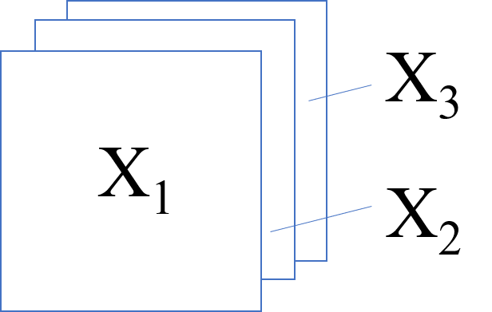

スカラー $\subset$ ベクトル $\subset$ 行列 $\subset$ テンソルのような関係でありました。線形代数では $\boldsymbol{y}$ や $\boldsymbol{X}$ といった文字だけで式変形をしていくため、どのような形の数値が取り扱われているかわかりくいのですが、これはベクトルなどと常に意識しておくことでその形を見失わないように注意しましょう。

|        | 小文字         | 大文字         |
| ------ | -------------- | -------------- |
| 細文字 | スカラーの変数 | スカラーの定数 |
| 太文字 | ベクトル       | 行列、テンソル |

### 足し算・引き算

行列やベクトルの演算について覚えていきましょう。足し算や引き算は、
$$
\begin{aligned}&\begin{bmatrix}
1 \\
2 \\
3
\end{bmatrix}+\begin{bmatrix}
4 \\
5 \\
6
\end{bmatrix}=\begin{bmatrix}
1+4 \\
2+5 \\
3+6
\end{bmatrix}=\begin{bmatrix}
7 \\
8 \\
9
\end{bmatrix}\\
&\begin{bmatrix}
1 & 2 & 3 \\
4 & 5 & 6
\end{bmatrix}+\begin{bmatrix}
7 & 8 & 9 \\
10 & 11 & 12
\end{bmatrix}=\begin{bmatrix}
8 & 10 & 12 \\
14 & 16 & 18
\end{bmatrix}\end{aligned}
$$

ように行列やベクトルの中の**要素**で対応する場所を足し合わせます。引き算も同様です。計算としては単純なものであり、特別なことはありません。ここでポイントとして、**同じサイズでないと計算が成立しない**ということをおぼえておきましょう。

### かけ算（行列積）

行列の掛け算は複数パターンあり、一般的に掛け算として認識されているものは**行列積**と呼ばれます。それ以外には外積や要素積（アダマール積）などがあります。行列積は計算の方法が少し変わっており、以下のように、「行」「列」と線を引きながら計算していきましょう。

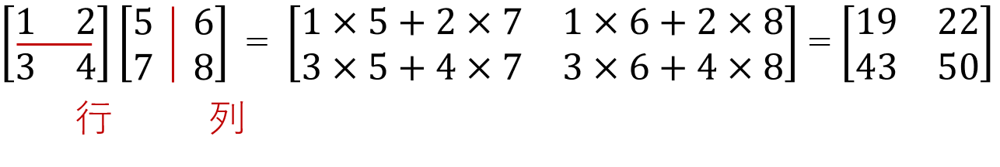

このように、単純に足し算や引き算のように要素ごとの積を扱うわけではないため、最初は計算に慣れが必要です。そして、行列積では計算が成り立つためには、

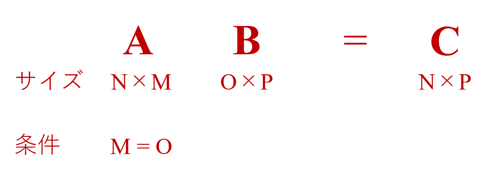

が条件となります。このように行列積は特殊な計算方法になっているが、この変わった計算方法が機械学習にとってはうまく作用します。また、行列ではかけ算はありますが割り算に相当する演算はありません。理由としては、$4 / 2 = 4 \times \dfrac{1}{2}$ のように割り算を掛け算で記述することができるためです。

それでは、この計算条件の確認も踏まえて、下記の３つを練習問題として解いてください。
$$
\begin{aligned}
&\left( 1\right) \begin{bmatrix} 1 & 2 \end{bmatrix}\begin{bmatrix} 3 \\ 4 \end{bmatrix}\\ 
&\left( 2\right) \begin{bmatrix} 1 & 2 \\ 3 & 4 \end{bmatrix}\begin{bmatrix} 5 \\ 6 \end{bmatrix}\\ 
&\left( 3\right) \begin{bmatrix} 1 & 2 \end{bmatrix}\begin{bmatrix} 3 & 4 \\ 5 & 6 \end{bmatrix}\begin{bmatrix} 3 \\ 1 \end{bmatrix}\end{aligned}
$$

それでは、こちらが解答です。

$$
\begin{aligned}
&\left( 1\right) \begin{bmatrix} 1 & 2 \end{bmatrix}\begin{bmatrix} 3 \\ 4 \end{bmatrix} = 1\times 3 + 2 \times 4 = 11\\ 
&\left( 2\right) \begin{bmatrix} 1 & 2 \\ 3 & 4 \end{bmatrix}\begin{bmatrix} 5 \\ 6 \end{bmatrix} = \begin{bmatrix}1\times 5 + 2\times 6 \\3 \times 5 + 4 \times 6\end{bmatrix} = \begin{bmatrix}17 \\ 39\end{bmatrix}\\ 
&\left( 3\right) 
\begin{bmatrix}
1 & 2
\end{bmatrix}\begin{bmatrix}
3 & 4 \\
5 & 6
\end{bmatrix}\begin{bmatrix}
3 \\
1
\end{bmatrix}
=\begin{bmatrix}
1 & 2
\end{bmatrix}\begin{bmatrix}
3\times 3+4\times 1 \\
5\times 3 +6\times 1
\end{bmatrix}
=\begin{bmatrix}
1 & 2
\end{bmatrix}\begin{bmatrix}
13 \\
21
\end{bmatrix}
=1 \times 13+2\times 21
=55
\end{aligned}
$$

計算のイメージは沸いたでしょうか。実は、この３つの計算は機械学習においてよく出てくる形の計算です。押さえておくべきポイントとして、演算後に形が変わることを覚えておきましょう。

### サイズ感

この言葉は筆者が定義した言葉ですが、計算を行う上でこの**サイズ感**を覚えておくことが機械学習を円滑に理解するためのひとつのポイントではないかと思います。先ほどの３つの練習問題のサイズがどのように変化したかをまとめると、

のようになります。もともとがベクトルや行列であっても、演算後にスカラーになるケースもあることがわかります。先ほど計算したこともあり、こちらは納得していただけると思います。さて、なぜこのサイズが変化する感覚をつかんでおくことが大事になのでしょうか。

今回は数値で計算結果を追っていましたが、これからの計算はすべて数値ではなく文字で表現して扱います。線形代数を勉強し始めの人が $\boldsymbol{x}^{T}\boldsymbol{A}\boldsymbol{y}$ を見て、スカラーであると瞬時に判断できるかというと、印象的にはより複雑な何かになるという印象があると思います。ここで、ベクトルは縦向きで定義するため、横向きのベクトルは**転置**（記号は上付きの $T$）を使うことによって表現しています。

### 転置

ベクトルは縦向きが基本としていましたが、先程の計算問題などでは、しばしば横向きのベクトルが出てきました。そこで登場するベクトルの縦と横を入れ替える演算のことを**転置**（Transpose）と呼び、
$$
\begin{aligned}\boldsymbol{x}&=\begin{bmatrix}
1 \\
2 \\
3
\end{bmatrix}, \ 
\boldsymbol{x}^{T}=\begin{bmatrix} 1 & 2 & 3 \end{bmatrix} \\
\boldsymbol{X}&=\begin{bmatrix}
1 & 4 \\
2 & 5 \\
3 & 6
\end{bmatrix}, \
\boldsymbol{X}^{T}=\begin{bmatrix}
1 & 2 & 3 \\
4 & 5 & 6
\end{bmatrix}\end{aligned}
$$
のようになります。このように転置自体の演算は簡単です。転置では下記３つの公式を覚えておくと、これからの計算が楽になります。

$$
\begin{aligned}&\left( 1\right) \ \left( \boldsymbol{A}^{T}\right)^{T}=\boldsymbol{A}\\
&\left( 2\right) \ \left( \boldsymbol{A}\boldsymbol{B}\right) ^{T}=\boldsymbol{B}^{T}\boldsymbol{A}^{T}\\
&\left( 3\right) \ \left( \boldsymbol{A}\boldsymbol{B}\boldsymbol{C}\right) ^{T}=\boldsymbol{C}^{T}\boldsymbol{B}^{T}\boldsymbol{A}^{T}\end{aligned}
$$

### 単位行列

単位行列とは、スカラーの１に対応した性質をもつ行列です。どのような性質かというと、10$\times$1のように、乗じても変わらないという性質です。行列の演算において、これと同様の働きをする行列が**単位行列**になり、
$$
\boldsymbol{I}=\begin{bmatrix}
1 & 0 & \ldots  & 0 \\
0 & 1 & \ldots  & 0 \\
\vdots & \vdots  & \ddots  & \vdots  \\
0 & 0 & \ldots  & 1
\end{bmatrix}
$$
のような形をしています。斜めの要素を**対角要素**と呼ぶのですが、対角要素が1で、それ以外の要素が0です。もう少し具体的に $\boldsymbol{I} \in \mathcal{R}^{2\times 2}$ の場合、
$$
\boldsymbol{I} =\begin{bmatrix}
1 & 0 \\
0 & 1
\end{bmatrix}
$$
であり、$\boldsymbol{I} \in \mathcal{R}^{3\times 3}$ の場合、
$$
\boldsymbol{I}=\begin{bmatrix}
1 & 0 & 0 \\
0 & 1 & 0 \\
0 & 0 & 1
\end{bmatrix}
$$
となります。

実際に計算して、元の行列と値が変わらないかを確認してみると、
$$
\begin{aligned}\begin{bmatrix}
1 & 2 \\
3 & 4
\end{bmatrix}\begin{bmatrix}
1 & 0 \\
0 & 1
\end{bmatrix}
&=\begin{bmatrix}
1\times 1+2\times 6 & 1\times 0+2\times 1 \\
3\times 1+4\times 0 & 3\times 0+4\times 1
\end{bmatrix}\\
&=
\begin{bmatrix}
1 & 2 \\
3 & 4
\end{bmatrix}
\end{aligned}
$$
のように、確かに元の値と同じであることがわかりました。単位行列 $\boldsymbol{I}$ の性質は
$$
\begin{aligned}
\boldsymbol{A}\boldsymbol{I}&=\boldsymbol{A}\\
\boldsymbol{I}\boldsymbol{A}&=\boldsymbol{A}
\end{aligned}
$$

となります。

### 逆行列

**逆行列**とは
$$
2 \times 2^{-1} = 1
$$

のようなスカラーの逆数に対応するような行列です。英語では **Inverse Matrix **です。

逆行列の定義は
$$
\begin{aligned}
\boldsymbol{A}\boldsymbol{A}^{-1}=\boldsymbol{I}\\
\boldsymbol{A}^{-1}\boldsymbol{A}=\boldsymbol{I}
\end{aligned}
$$
であり、ここで、$\boldsymbol{I}$ は単位行列です。この逆行列も機械学習の計算過程に頻出するため覚えておきましょう。大学で習う線形代数の授業では、$2 \times 2$ や $3 \times 3$ の逆行列の計算方法について習いますが、実際に扱うものは $10 \times 10$ などさらに大きく、当然コンピュータで計算するものであるため、その計算方法については余裕が出てから知る程度でも良いと思っています。ただし、どのような行列においても逆行列を計算できるわけではないため、計算できるための条件は知っておきましょう。逆行列は**正方行列**と呼ばれる行と列のサイズが同じでないと計算することができず、これが最低限の条件となる。さらに詳細にはフルランクであることがあるが、こちらも計算に慣れて余裕が出てきてからさらに深めるので大丈夫です。

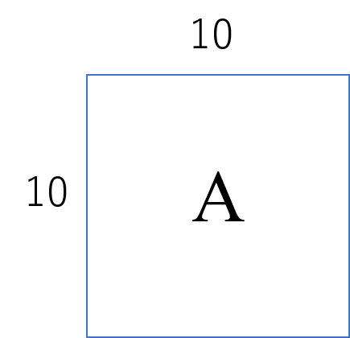

### 線形結合と二次形式

これからの機械学習の数学でもよく出てくる形式として $\boldsymbol{b}^{T}\boldsymbol{x}$ と $\boldsymbol{x}^{T}\boldsymbol{A}\boldsymbol{x}$ のような２つがあります。前者を**線形結合**もしくは**一次結合**、$\boldsymbol{x}^{T}\boldsymbol{A}\boldsymbol{x}$ のような形式を**二次形式**と呼ばれています。中学校の数学で言うなら、一次式か二次式かといった話だと分かりやすいと思います。

線形結合の計算の中身を見てみると、
$$
\begin{aligned}
\boldsymbol{b}&=\begin{bmatrix}
1 \\
2
\end{bmatrix},\ 
\boldsymbol{x}=\begin{bmatrix}
x_{1} \\
x_{2}
\end{bmatrix}\\
\boldsymbol{b}^{T}\boldsymbol{x}&=\begin{bmatrix}
1 & 2
\end{bmatrix}\begin{bmatrix}
x_{1} \\
x_{2}
\end{bmatrix}=x_{1}+2x_{2}\end{aligned}
$$
のように $\boldsymbol{x}$ の要素である $x_{1}$ もしくは $x_{2}$ に関して、1次式となっていることがわかります。

また、二次形式も同様に計算の中身を確認してみると、
$$
\begin{aligned}
\boldsymbol{A}&=\begin{bmatrix}
1 & 2 \\
3 & 4
\end{bmatrix},\ 
\boldsymbol{x}=\begin{bmatrix}
x_{1} \\
x_{2}
\end{bmatrix}\\
\boldsymbol{x}^{T}\boldsymbol{A}\boldsymbol{x}
&=\begin{bmatrix} x_{1} & x_{2}\end{bmatrix}
\begin{bmatrix}
1 & 2 \\
3 & 4
\end{bmatrix}\begin{bmatrix}
x_{1} \\
x_{2}
\end{bmatrix}\\
&=\begin{bmatrix}x_{1} & x_{2}\end{bmatrix} \begin{bmatrix}
x_{1}+2x_{2} \\
3x_{1}+4x_{2}
\end{bmatrix}\\
&=x_{1}\left( x_{1}+2x_{2}\right) +x_{2}\left( 3x_{1}+4x_{2}\right) \\
&=x^{2}_{1}+5x_{1}x_{2}+4x_{2}^{2}\end{aligned}
$$
となり、各要素において二次式となっていることがわかります。

そして、一般にこれらを足し合わせて、
$$
\boldsymbol{x}^{T}\boldsymbol{A}\boldsymbol{x} + \boldsymbol{b}^{T}\boldsymbol{x} + c
$$
のように二次関数を表現します。ここで、$c$ はスカラーの定数項です。

### ベクトルで微分

機械学習において何度も出てくる重要な演算ですが、参考書では書かれていないことがよくあります。

まず、ベクトルで微分の計算を紹介する前に、下記の例題を計算しましょう。
$$
\begin{aligned}
\boldsymbol{b}&=\begin{bmatrix}
3 \\
4
\end{bmatrix}, \ 
\boldsymbol{x}=\begin{bmatrix}
x_{1} \\
x_{2}
\end{bmatrix}\\
\boldsymbol{b}^{T}\boldsymbol{x}&=\begin{bmatrix}
3 & 4
\end{bmatrix}\begin{bmatrix}
x_{1} \\
x_{2}
\end{bmatrix}
=3x_{1}+4x_{2}\end{aligned}
$$
この計算は線形結合としてすでに紹介していますが、ここからが本題です。この $\boldsymbol{b}^{T}\boldsymbol{x}$ を ベクトル $\boldsymbol{x}$ で微分したいというシチュエーションが機械学習の中では登場します。つまり、

$$
\dfrac {\partial }{\partial \boldsymbol{x}}\left( \boldsymbol{b}^{T}\boldsymbol{x}\right)
$$
を求めたいというわけです。これを**ベクトルで微分**すると言います。果たして、このベクトルで微分は複雑な計算か、シンプルな計算なのかどちらでしょうか。実はその答えは非常にシンプルであり、具体的には
$$
\begin{aligned}
\dfrac {\partial }{\partial \boldsymbol{x}}\left( \boldsymbol{b}^{T}\boldsymbol{x}\right) &=\dfrac {\partial }{\partial \boldsymbol{x}}\left( 3x_{1}+4x_{2}\right) \\
&=\begin{bmatrix}
\dfrac {\partial }{\partial x_{1}} \left( 3x_{1}+4x_{2}\right)  \\
\dfrac {\partial }{\partial x_{2}} \left( 3x_{1}+4x_{2}\right) 
\end{bmatrix}
\end{aligned}
$$
のように、ベクトルの要素（今回だと $x_1$と$x_{2}$）のそれぞれで偏微分した値をベクトルとして格納していくだけです。一見複雑そうに見えますが、シンプルな演算で構成されていることがわかります。実際に計算していくと、

$$
\begin{aligned}\dfrac {\partial }{\partial x_{1}}\left( 3x_{1}+4x_{2}\right) &=\dfrac {\partial }{\partial x_{1}}\left( 3x_{1}\right) +\dfrac {\partial }{\partial x_{1}}\left( 4x_{2}\right) \\
&=3\times \dfrac {\partial }{\partial x_{1}}\left( x_{1}\right) +4x_{2}\times \dfrac {\partial }{\partial x_{1}}\left( 1\right) \\
&=3\times 1+4x_{2}\times 0\\
&=3\end{aligned}
$$

$$
\begin{aligned}\dfrac {\partial }{\partial x_{2}}\left( 3x_{1}+4x_{2}\right)&=\dfrac {\partial }{\partial x_{2}}\left( 3x_{1}\right) +\dfrac {\partial }{\partial x_{2}}\left( 4x_{2}\right) \\
&=3x_{1}\times \dfrac {\partial }{\partial x_{2}}\left( 1\right) +4\times \dfrac {\partial }{ax_{2}}\left( x_{2}\right) \\
&=3x_{1} \times 0 + 4 \times 1 \\
&= 4
\end{aligned}
$$

となり、下記の計算結果が得られます。
$$
\begin{aligned}
\dfrac {\partial }{\partial \boldsymbol{x}}\left( \boldsymbol{b}^{T}\boldsymbol{x}\right) 
&=\begin{bmatrix}
\dfrac {\partial }{\partial x_{1}} \left( 3x_{1}+4x_{2}\right)  \\
\dfrac {\partial }{\partial x_{2}} \left( 3x_{1}+4x_{2}\right) 
\end{bmatrix} =\begin{bmatrix}
3  \\
4
\end{bmatrix} = \boldsymbol{b}
\end{aligned}
$$
ここで、ベクトルで微分した結果が最初の $\boldsymbol{b}$ と同じになっていることがわかります。これはたまたまではなく、一般的に成り立ちますが、この結果は最後に公式としてまとめましょう。

もう一問、以下の例題を考えましょう。
$$
\begin{aligned}
\boldsymbol{x}&=\begin{bmatrix}
x_{1} \\
x_{2}
\end{bmatrix}\\
\dfrac {\partial }{\partial \boldsymbol{x}}\left( 1\right) &=\begin{bmatrix}
\dfrac {\partial }{\partial x_{1}}\left( 1\right)  \\
\dfrac {\partial }{\partial x_{2}}\left( 1\right) 
\end{bmatrix}
=\begin{bmatrix}
0 \\
0
\end{bmatrix}=\boldsymbol{0}\end{aligned}
$$
もちろん、偏微分を行う対象の変数が含まれていない場合は 0 となります。要素が 0 のみで構成されたベクトルを**零（ゼロ）ベクトル**と言います。

これらを踏まえて、公式としてまとめておきましょう。
$$
\begin{aligned}
&\left( 1\right) \ \dfrac {\partial}{\partial \boldsymbol{x}}\left( c\right) = \boldsymbol{0}\\
&\left( 2\right) \ \dfrac {\partial }{\partial \boldsymbol{x}}\left( \boldsymbol{b}^{T}\boldsymbol{x}\right) = \boldsymbol{b}\\
&\left( 3\right) \ \dfrac {\partial }{\partial \boldsymbol{x}}\left( \boldsymbol{x}^{T}\boldsymbol{A}\boldsymbol{x}\right) =\left( \boldsymbol{A}+\boldsymbol{A}^{T}\right) \boldsymbol{x}\end{aligned}
$$
(1) と (2) に関してはすでに計算したものであり、(3) に関しては導出が少し複雑なので省略しますが、数値を代入して確認してみてください。こちらの 3 つの公式は機械学習を学んでいく上で非常に重要な公式となりますので、必ず覚えておきましょう。

こういった行列などにおける公式は他にもたくさんあり、論文などを読む際にはどういった公式があるのかを知っておくことも重要です。その際に、私がよく用いる便利な公式集がネット上にあり、[The Matrix Cookbook](https://www.math.uwaterloo.ca/~hwolkowi/matrixcookbook.pdf) が無料で公開されており、おすすめです。

## 統計

### 確率や統計は何に使えるの？

機械学習といえば確率や統計といったイメージで参考書を買ってきて勉強する人もいるだろうが、先ほどまでの重回帰分析では、微分と線形代数を理解しておくだけで説明することができた。それでは、確率統計では何を行うことができるのだろうか。

筆者は大きく2点あると考えている。データの分布の情報を定量評価できることと、データの分布を定式化できることである。一見、同じように見えるかもしれないが、目的がそれぞれ異なる。前者では、データの平均などといった情報を知ることで、アルゴリズムの前に、データの前処理として使う。後者では、重回帰分析などと同様にアルゴリズムのモデルとして、分布の情報を定式化して取り入れていくのである。要するに使い道が前処理なのか、モデル化なのかである。前者の使い方の場合、学ぶべき数学が非常に少なくて済む。そして、後者の場合、**ベイズ統計**と呼ばれる生成モデルを取り扱うための数学が必要となり、多くの前提知識を必要とする。確率統計とひとつにまとめて呼ばれがちであるが、前者は統計で、後者は確率である。

本書では、この両者のアプローチを紹介するが、最初からベイズ統計向けに必要な数学をまとめると多くの人が挫折してしまうために、これは本書の後半で扱うこととする。そこで、まずこの章ではデータの前処理のための統計を学ぶ。

この統計を学ぶことによって得られるスキルとしては、次の2つの問題に対して解決策を提示できることである。

各カラムの値が0～100であったり、0～1であったり、スケールがばらばらであり、アルゴリズム内部でデータを扱う際に良くないことがある。各サンプル間の距離を計算する際に、大きなスケールの値に大きく引っ張られてしまうなどである。各列のスケールに依存しないスケーリングを行いたい。

データの欠損値であればデータ上で簡単に見つけることができるため取り除くのは難しくないが、データの外れ値は「どのようなデータが外れているのか」といった定義が必要であり、外れ値を定義したい。

この**スケーリング**と**外れ値除去**は、データの前処理として実務ではほぼ必ず行うものである。

### 統計量

ここでは、とても簡単ではあるが、よく使う統計量とその意味について紹介する。

まずは初めに**平均**である。たとえば、300円, 400円, 500円の平均は、
$$
\dfrac{300 + 400 + 500}{3} = 400
$$
となり、すべてを足し合わせて候補の数で割れば良い。これを定式化すると、
$$
\begin{aligned}\overline {x}=\dfrac {x_{1}+x_{2}+\ldots +x_{N}}{N}
=\dfrac {1}{N}\sum ^{N}_{n=1}x_{n}\end{aligned}
$$
のようになる。平均は$\bar{x}$や$\mu$で表すことが多い。データの分布ではその中心に相当する値である。

次に、**分散**である。この時点で、日常生活では登場する場面が少なくなるため、分散とは何を表す値かご存知であろうか。まず分散の定義は以下の通りである。
$$
\begin{aligned}\sigma ^{2}=\dfrac {1}{N}\sum ^{N}_{n=1}\left( x_{n}-\overline {x}\right) ^{2}\end{aligned}
$$
このように、平均$\bar{x}$からの差分 $x- \bar{x}$ を計算し、それが二乗誤差の場合と同様、正と負の値を持ってしまうため、二乗してすべてを正にしてから総和を取って、平均しているのである。つまり、平均からどの程度離れているか（の二乗）の平均値である。これを何に使うことができるかの前に、分散にはもう一つ定義があり、
$$
\begin{aligned}
\sigma ^{2}=\dfrac {1}{N-1}\sum ^{N}_{n=1}\left( x_{n}-\overline {x}\right) ^{2}
\end{aligned}
$$
と表す場合もある。前者は**母分散**といい、後者は**不偏分散**という。なぜ$N$と$N-1$であるかは他の解説書〇〇（マセマの統計）にゆずるとして、大事なことはどちらを使うかである。

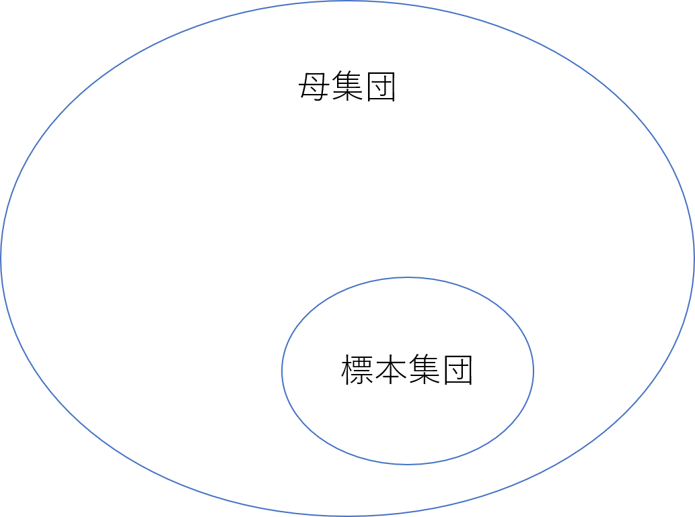

データ解析を行う際に、**母集団**に対する解析か**標本集団**に対する解析かを意識する必要がある。母集団とは仮定しているすべてのデータセットがそろっている場合であり、標本集団はそのうちの一部を抽出する場合である。例えば、全国の小学生の身長と体重を集計する場合に、全国の小学生を一人の抜け漏れもなく集められれば、それは母集団である。それに対し、各都道府県で100人ずつ抜き出して、集計する場合は標本集団である。母集団として想定しているすべてのデータを集めることはほとんどのケースで不可能であるため、基本的に実問題で取り扱うのは標本集団である。ピックアップされた一部のデータから母集団の情報を推定するのである。そのため、基本的には標本集団向けである不偏分散を使用することとなる。

さて、分散についての定義がわかったところで、これは何に使えるのだろうか。分散はデータのばらつきを定量評価することができるツールである。中心からどの程度ばらついているか。実験をしたときに、このばらつきが多ければ、各実験で再現性を確保できていないことを見つけることができる。このように、何度か試行して平均に集まっていることが望ましい状況において、ざっくりと感覚で議論するのではなく、定量評価できることはとてもありがたい。また、0～1のスケールのデータでは、分散は小さな値になり、0～1000のスケールのデータでは、分散は大きな値になる。もちろん、そのばらつきにもよるが、分散ではスケールの違いも評価することができる。そのため、この情報はスケーリングに使えそうであることがわかる。

最後に**標準偏差**である。分散では二乗を行うため、元のスケールの二乗となってしまう欠点がある。これでは、データに基づいて議論する場合に、二乗のスケールを考慮しながら話す必要があり、混乱しやすい。そこで、一般的には、元のスケールで議論するため、
$$
\sigma = \sqrt{\sigma^{2}}
$$
のように、分散のルートをとる。

それでは、定義と使い道が見えてきたところで、練習問題で具体的な計算手順の確認を行う。以下の平均、分散、標準偏差を求めよ。ただし、今回は母分散を使用することとする。

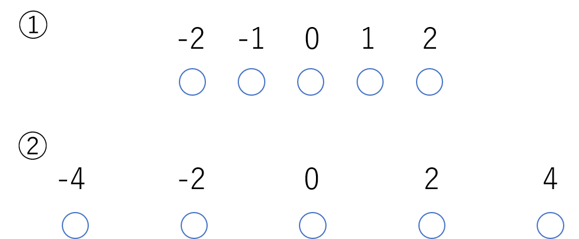

①の解答は以下のとおりである。
$$
\begin{aligned}
\bar{x}&=\dfrac {1}{5}\left( -2-1+0+1+2\right) =0\\
\sigma ^{2}&=\dfrac {1}{5}\left\{ \left( -2-0\right) ^{2}+\left( -1-0\right) ^{2}+(0-0)^{2}+(1-0)^{2}+(2-0)^{2}\right\} \\
&=\dfrac {1}{5}\times 10=2\\
\sigma &=\sqrt {2}
\end{aligned}
$$
また、②の解答は以下の通りである。
$$
\begin{aligned}
\overline {x}&=\dfrac {1}{5}\left( -4-2+0+2+4\right) =0\\
\sigma ^{2}&=\dfrac {1}{5}\left\{ \left( -4-0\right) ^{2}+\left( -2-0\right) ^{2}+\left( 0-0\right) ^{2}+\left( 2-0\right) ^{2}+\left( 4-0\right) ^{2}\right\} \\
&=\dfrac {1}{5}\times 40=8\\
\sigma &=\sqrt {8}=2\sqrt {2}
\end{aligned}
$$
これより、②のケースの方が分散が大きく、データのばらつきが大きいことがわかる。

### 正規分布

確率では何度も登場する**正規分布**。ガウス分布とも呼ばれている。まずは数式の前に、以下のような形をしている。

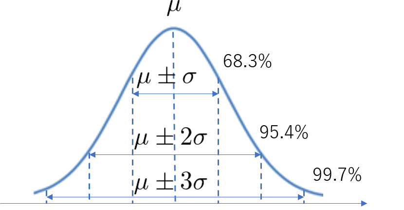

では、なぜこの正規分布が広く使われているのだろうか。以下の二点が挙げられると考えている。

- 物理現象でこの分布に従うことがよくある
- 数式が扱いやすい

このような物理現象の面と、工学的な取り扱い易さの面と両方兼ね備えている。

そして、正規分布では平均$\mu$と標準偏差$\sigma$に対して、何%がその分布に入っているかがわかる。

このように、$\mu \pm 3\sigma$ の範囲内に、データの全体の99.7%が入っていることがわかる。さて、それはそれとして、これを何に使うのであろうか。

実はこの$\mu \pm 3\sigma$が外れ値除去に使えるのである。外れ値という定義を行うことは一般的に難しいが、この方法であれば、全体の0.3%、つまり1000個中3個が外れ値になるようなラインを設定できるのである。

### スケーリング

スケーリングはどのアルゴリズムでも重要になってくるが、ここでは簡単に２つの事例を紹介する。

まず１つ目が距離の問題である。以下の図において、

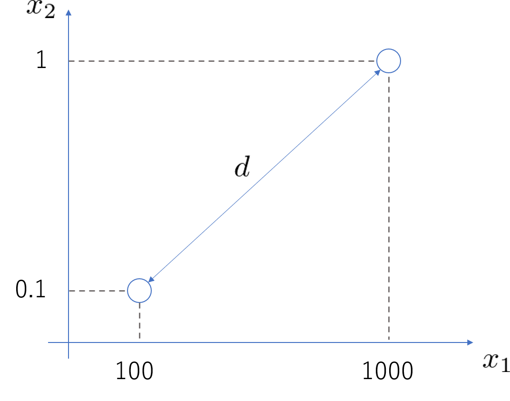

この２点間の距離$d$を求めると、
$$
\begin{aligned}
d&=\sqrt {\left( 100-1000\right) ^{2}+\left( 0.1-1\right) ^{2}}\\
&= \sqrt {900^{2}+0.9^{2}}\\
&= \sqrt {810000+0.81} \\
&= \sqrt {810000.81}
\end{aligned}
$$
のようになる。ここで着目したい点として、$x_{1}$ と $x_{2}$のどちらが距離 $d$ に対して影響を与えているかであるが、明らかに $x_{1}$ である。$x_{2}$ に関しては、スケールが小さいがゆえに、影響を与えることがほとんどできずに終わっている。これでは、$x_{2}$ がデータの意味として重要な場合においても考慮できずに終わってしまうといった問題点がある。

また、もうひとつが重回帰分析の重みである。重回帰分析によって最適なパラメータが求まった場合、新しいサンプルに対する予測値の計算は

のようになる。もちろん、予測値の計算としてはこれで十分である。

ここで、予測値の計算だけでなく、どの変数がこの予測に大きく影響を与えているかを知りたいとする。そう考えたときに、絶対値として最も大きな$w_{M}$の犯罪発生率であると決めて良いだろうか。予測値を計算してみるとわかるが、重み×入力の総和を取るため、重みが直接その入力変数の与える影響を表しているわけではない。

このように、重み×入力で見てみると、最も影響を与えている変数は駅からの距離であることがわかる。実際の数値を入れてみるまで各変数の影響度を測れなければ、クライアントに説明することはできない。そこで、考え方として、各入力変数のスケールを統一することができれば、重み×入力の入力が統一されることとなり、重みが影響度を直接表すことができるのである。

さて、実例でのスケーリングの使い道が見てきたところで、どのようにスケーリングを行えばよいか。大きく２つの方法がある。

１つ目が、最小値0、最大値1にスケーリングする方法である。これを**Min-Max スケーリング**と呼ぶ。この方法は至って単純で、データの最小値$x_{\min}$ と最大値$x_{\max}$ を事前に求めておき、すべてのデータに対して、以下の操作を行う。
$$
\widetilde{x} = \dfrac{x - x_{\min}}{x_{\max} - x_{\min}}
$$
ここで、これは各入力変数ごとに行う。例えば、入力変数が10個ある場合では、10個の最小値・最大値を求め、10列それぞれに対して、上記の計算を行う。Min-Maxスケーリングには計算が単純というメリットの反面、

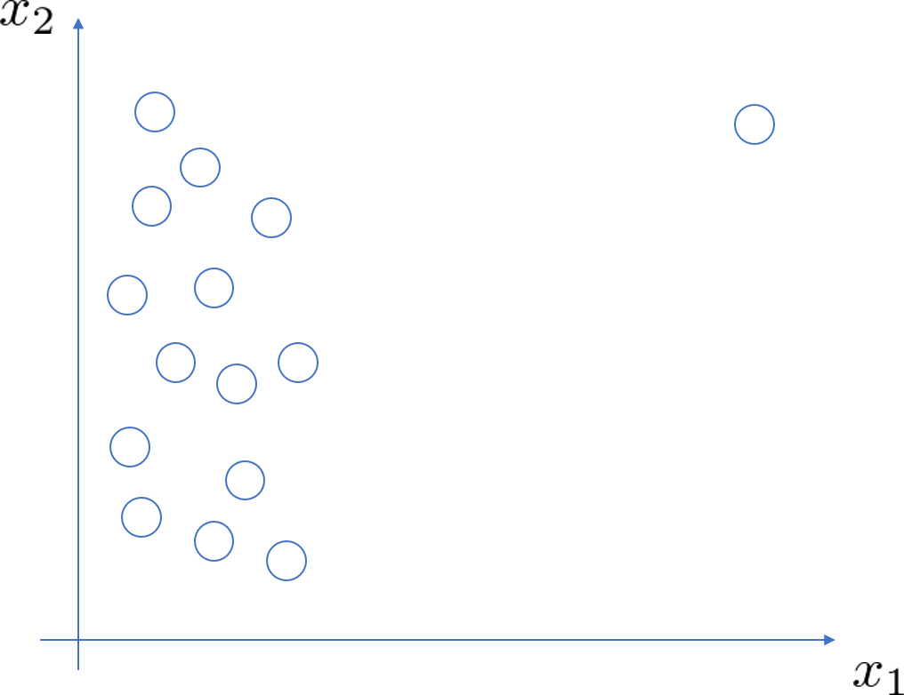

上図のように、$x_1$で外れ値が存在し、$x_{\max}$ が外れ値であるこの一点に大きく引っ張られてしまう。そのため、これは外れ値に弱い方法である。

もう１つのスケーリングの方法として、平均0, 標準偏差1にスケーリングする方法がある。分散含め、標準偏差ではデータのばらつきを定量評価することができ、
$$
\widetilde{x}  = \dfrac{x - \bar{x}}{\sigma}
$$
のように、標準偏差で割ることで、スケールを統一することができる。分散で計算した例題の①に対して、適用してみると、
$$
\begin{aligned}
x_{1}&=\dfrac {-2-0}{\sqrt {2}}=-\dfrac {2}{\sqrt {2}}\\
x_{2}&=\dfrac {-1-0}{\sqrt {2}}=-\dfrac {1}{\sqrt {2}}\\
x_{3}&=\dfrac {0-0}{\sqrt {2}}=0\\
x_{4}&=\dfrac {1-0}{\sqrt {2}}=\dfrac {1}{\sqrt {2}}\\
x_{5}&=\dfrac {2-0}{\sqrt {2}}=\dfrac {2}{\sqrt {2}}
\end{aligned}
$$
のように、データが変換される。この時の平均と標準偏差を求めてみると、
$$
\begin{aligned}
\overline {x}&=\dfrac {1}{5}\left( -\dfrac {2}{\sqrt {2}}-\dfrac {1}{\sqrt {2}}+0+\dfrac {1}{\sqrt {2}}+\dfrac {2}{\sqrt {2}}\right) =0\\
\sigma ^{2}&=\dfrac {1}{5}\left\{ \left( -\dfrac {2}{\sqrt {2}}-0\right) ^{2}+\left( -\dfrac {1}{\sqrt {2}}-0\right) ^{2}+\left( 0-0\right) ^{2}
 +\left( \dfrac {1}{\sqrt {2}}-0\right) ^{2}+\left( \dfrac {2}{\sqrt {2}}-0\right) ^{2}\right\} =1\\
\sigma &=\sqrt {\sigma ^{2}}=1
\end{aligned}
$$
のように、平均0、標準偏差1にスケーリングできていることがわかる。この方法であれば、統計量を使用するため全体の傾向で議論することができ、一点だけの外れ値のようなケースには強い（これを**ロバスト**と表現する）。

### 外れ値除去

例えば、以下の図のように時間によって変動するようなデータを扱うとする。例えば、横軸が時刻、縦軸がCPUの負荷率(%)と考えるとわかりやすい。

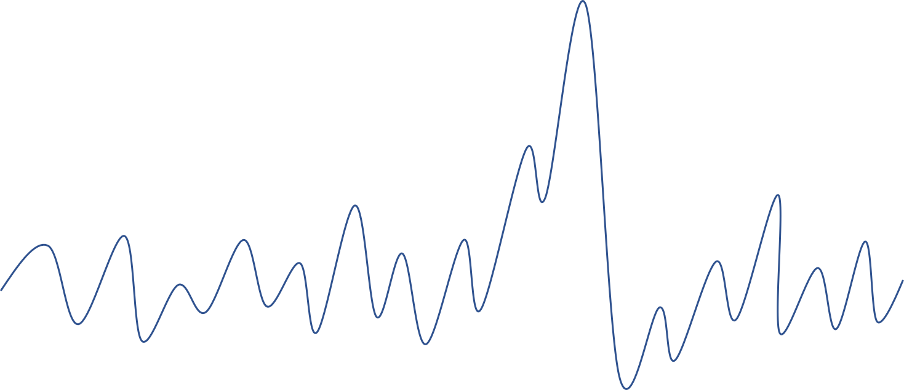

このデータに対して、CPUの負荷率が異常な場合（外れ値）を検出したいという場合、どのようにこの外れ値を検出すれば良いか。答えは、その値の頻度に着目すればよい。

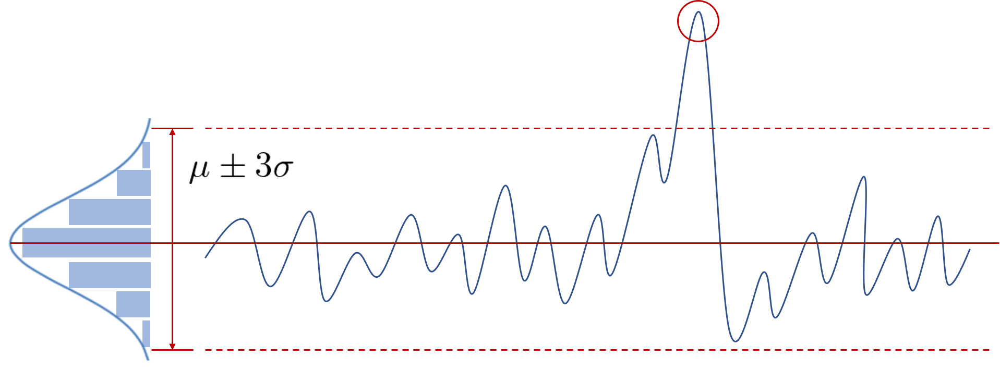

このように、平均に対して線を引き、それぞれの値において頻度を計算してみると、正規分布が現れる。物理現象として正規分布に従うものが多いと説明していたが、普段の生活で正規分布を目にすることがないので違和感を感じていた人も多いと思うが、このような頻度では中心付近の値の頻度は多く、離れるほど頻度が少なくなっていく現象に関しては違和感がないはずである。そして、このデータの平均$\mu$と標準偏差$\sigma$を計算し、$\mu \pm 3\sigma$の値に線を引けば、外れ値除去を行うことができる。これを**3σ法**と呼び、理論がシンプルかつ、プログラムの実装的にも平均と標準偏差だけで行えるため簡単であり、実用的な方法といえます。

外れ値の回数が多い場合などは平均や標準偏差がその外れ値に引っ張られ、3σ法ではうまく対処できない場合があり、そのような場合には中央値をベースとした**Hampel判別法**を用いることもある。