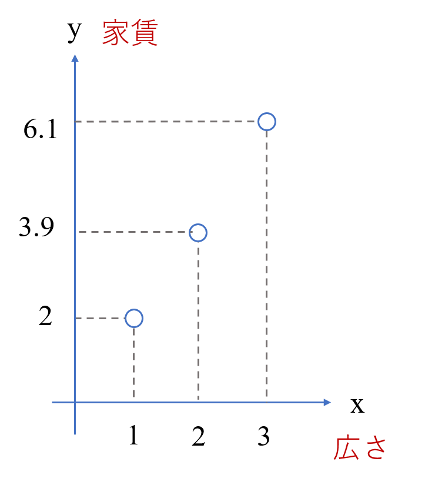
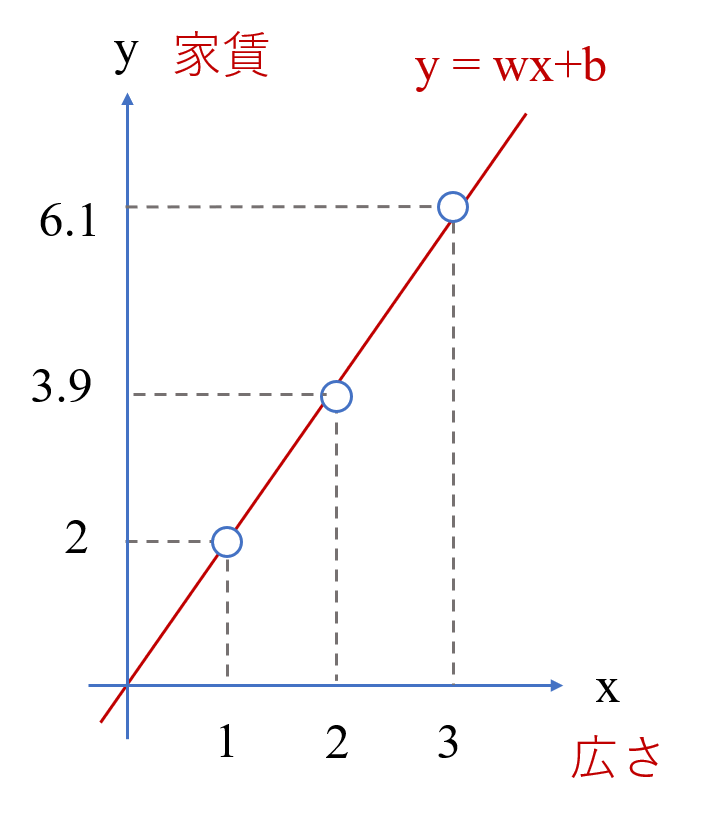
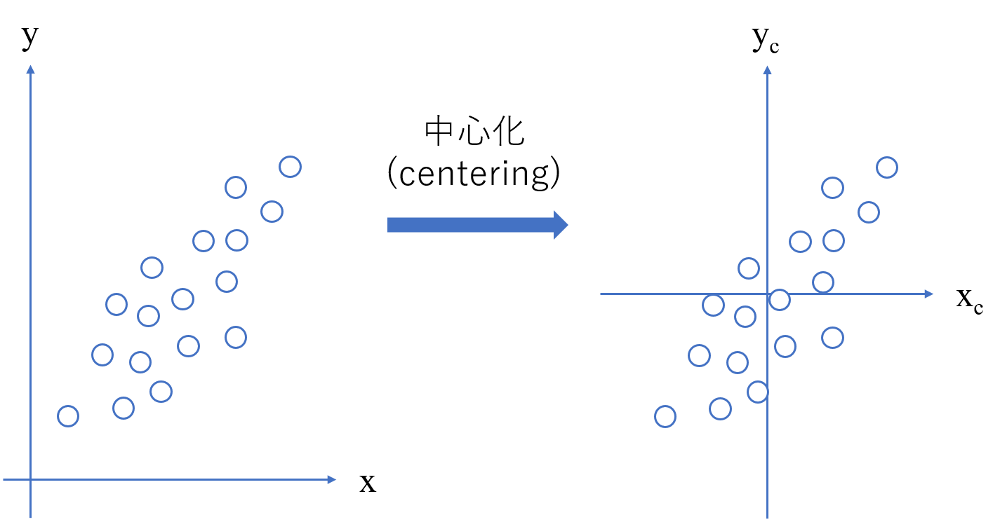
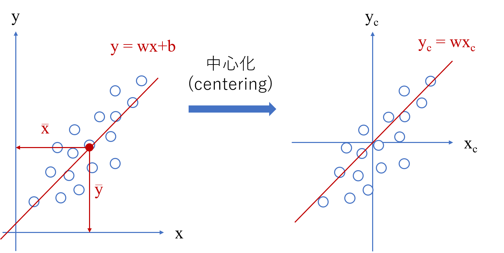
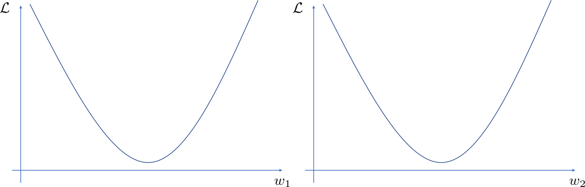
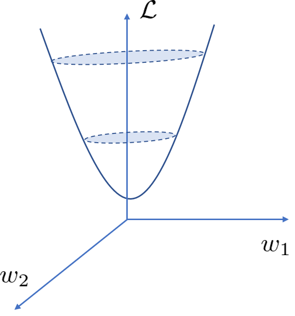
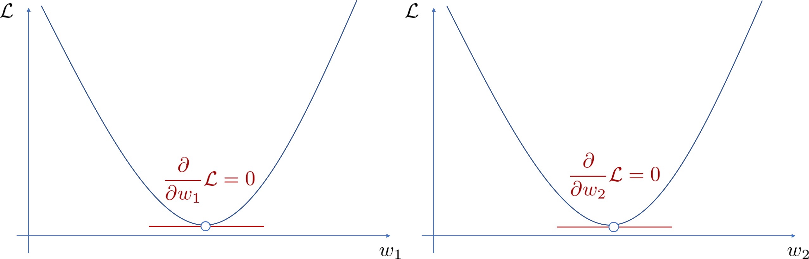

# 機械学習ライブラリの基礎

ここでは、代表的な機械学習アルゴリズムの紹介とチューニングのポイントをその数学的な背景と合わせて紹介します。
機械学習の考え方を身に着ける練習として、単回帰分析と重回帰分析のアルゴリズムを一緒に考えていきましょう。これらを学ぶことで微分と線形代数、統計に関する知識が大幅に深まります。

## 単回帰分析

機械学習アルゴリズムの第一弾として、最も基礎的な単回帰分析について紹介する。ほかの書籍では、基礎的な数学を前半で紹介して、後半で機械学習アルゴリズムを紹介するものも多いが、単回帰分析を学びながら具体的な微分の計算が身につくため、本書では基礎的な数学とそれに対応する機械学習アルゴリズムを交互に学びながら、知識を深めていくこととする。

単回帰分析は教師あり学習の一種である。その中でも、数値（厳密には連続値）を予測する**回帰**を取り扱う手法である。単回帰分析は、ひとつの入力変数からひとつの出力変数を予測する機械学習アルゴリズムである。

### 問題設定

身近な例で想像がつきやすいものとして、家賃の予測を考えることとする。つまり家賃が出力変数 $y$ となる。

次に考えるべき問題としては、入力変数として何を採用するかである。機械学習では、データをもとに学習するが、一番最初にどのデータを使ってどの値を予測させるかは人間側で決めないといけない。そのため、入力変数として何を採用するかといった問題は、人間側の経験に依存する。例えば、今回で言えば、部屋の広さか、駅からの距離か、それとも犯罪発生率を入力変数として採用するか悩ましいところである。今回は私の経験上、重要そうだと感じる部屋の広さを入力変数$x$として採用することとする。実際には、このように複数の候補があった際に、それらすべてを扱うことができるようなモデル化が一般的であり、この次の重回帰分析以降で紹介していく。

機械学習アルゴリズムは、どの手法も大きく分けて3つのステップで成り立っており、この3つのステップが1セットでひとつのアルゴリズムである。

- モデルを決める
- 目的関数を決める
- 最適なパラメータを求める

### Step1. モデルを決める

まず**Step1**は**モデル**を決める。このモデルとは一見もっともらしい用語ではあるが、具体的には何であるのか。それは、出力変数$y$と入力変数$x$の関係性を定式化したものである。家賃の予測値を$y$とした際に、どのように定式化すればうまく予測することができるのか。このモデルは残念ながら機械が自動的に決めてくれるわけではなく、人間が経験と勘で決める作業になる。

例えば、与えられたデータセットにおいて、家賃と部屋の広さの関係性が次のようになっている。数値は実際の家賃ではなく計算が簡単にできるように設定しているが、部屋の広さが広くなるほど、家賃が高くなるという設定である。このデータを見た際に、どのように予測のための線を描けば良いかと考えると、このように直線を引く人が多いのではないだろうか。

直線の式は中学の数学でもおさらいしたが、$y=ax+b$ である。$a$ を傾き、$b$ を切片と呼んでいた。

今回、このデータセットに対して、直線を引くことが適切であると（人間側の経験で）判断したため、以下のようにモデルを決める。
$$
y = wx + b
$$
傾き $a$ の箇所が $w$ となっているが、一般的に機械学習では、傾きの箇所を**重み (weight)** $w$, 切片 $b$ の箇所を**バイアス (bias)** $b$ で記述することが多いので覚えておいてほしい。

単回帰分析では、このように直線 $y = wx + b$ と決めて、その重みとバイアスの値をデータにうまくフィットするように調整していくのである。この調整すべき変数のことを**パラメータ**と呼ぶ。つまり、今回は $w$ と $b$ がパラメータである。これより、この単回帰分析含めた機械学習の（学習工程の）ゴールとしては、与えられたデータセットに基づいて、最適なパラメータを求めることである。ここで与えられたデータセットとは、部屋の広さ $x$ と教師データとなる家賃 $t$ のことであり、$\mathcal{D} = \{x_n, t_n\}_{n=1}^{N}$ として表す。ここで、添え字 $n$ ($n=1,2,\ldots,N$)は$n$番目の物件という意味であり、$N$は全体の物件数のことである。この$N$を**サンプル数**という。

ここで、この後の計算を楽に進めるために、**データの中心化**というテクニックを紹介する。図に示すように、部屋の広さと家賃は両方とも正の値であるため、左のグラフのような形になる。これは当然のことで問題はないが、これを中心化では、平均を0とした中央に配置するように変換の処理を施す。この中心化はどのアルゴリズムでも前処理として行うことが一般的である（厳密には正規化がよく用いられ、〇〇章で解説する）。

この中心化の処理自体はそれほど難しいものではないが、なぜこのような処理を行うのかが問題である。それはデータの中心化によって、バイアス $b$ が0となり、$y_{c} = wx_{c}$ とすることができ、調整すべきパラメータを2つから1つに減らすことができる。

今回は、2つのパラメータを手計算で求めることを楽にするために、このデータの標準化を前処理として使用することとする。一般に、数式を変形していく際に、バイアス $b$ を省略できたほうが計算が楽なケースが多く、そのような場合は、前処理としてデータの標準化を行ったこととして、議論を進めることが多いため、この処理も覚えておいてほしい。

さて、データの中心化の目的は明確となったところで、このデータの中心化が難しければ、まったく意味がない。何かを簡単にするために、複雑な処理を挟んでしまっては本末転倒である。しかし、データの中心化は非常に簡単であり、入出力の平均をデータの全体から引くだけでよい。つまり、
$$
\begin{aligned}
x_{c} &= x - \bar{x} \\
t_{c} &= t - \bar{t}
\end{aligned}
$$
となる。

例えば、具体的な数値で見ると、下図となる。

この処理をプログラムで書くことは非常に容易である。

添え字の $c$ に関して、この先も書いていくと表現が冗長となるため、今後はこの添え字を省略し、データの中心化を事前に行っていることを前提とする。この時、モデルは
$$
y = wx
$$
となる。このとき、単回帰分析のゴールは、データセット $\mathcal{D} = \{x_n, t_n\}_{n=1}^{N}$ に基づいて、パラメータ$w$ を適切に調整することである。

### Step2. 目的関数を決める

Step1では決めたゴールには曖昧さが残っていた。それは「適切」という言葉である。一見もっともらしくも聞こえるが、適切の定義を決めていない中で適切は存在しない。そこで、適切の定義を決める必要があり、これを関数として定義したものを**目的関数**と呼ぶ。領域によっては評価関数と呼ばれることもある。

さて、今回はどのように目的関数を決めれば良いか。それは微分の時にもすでに紹介しているが、教師データと予測値の二乗誤差が小さければ小さいほど、適切と呼べるのではないだろうか。理想的には二乗誤差が0となれば、t = y となり、完璧な予測といえる。そのため、$n$ 番目の物件に対する教師データ$t_{n}$ と予測値$y_{n}$の二乗誤差は
$$
(t{_n} - y_{n})^{2}
$$
となる。これを全物件で考慮する必要があるため、最終的な目的関数は
$$
\begin{aligned}
\mathcal{L}&=\left( t_{1}-y_{1}\right)^{2}+\left( t_{2}-y_{2}\right)^{2}+\ldots + (t_{N}-y_{N})^{2} \\
&=\sum^{N}_{n=1}\left( t_{n}-y_{n}\right)^{2}\\
\end{aligned}
$$
となる。また、Step1で決めたモデルより、
$$
y_{n} = wx_{n}
$$
となるため、目的関数は
$$
\mathcal{L}=\sum^{N}_{n=1}\left( t_{n}-wx_{n}\right)^{2}
$$
とパラメータを含んだ形式で表現することができる。目的関数の中でも、教師データと予測値の差（損失）を考慮したんものを**損失関数**と呼ぶ。損失関数は常に最小化したいというモチベーションでパラメータの最適化を行う。

### Step3. 最適なパラメータを求める 

モデルと目的関数が決まると、あとは目的関数を最小化するようなパラメータを求めるだけである。ここで、ある関数を最小化する点を求める方法としては微分が使えることをすでに学んでいる。そのため微分して「傾き0」となる点が最適なパラメータである。
$$
\begin{aligned}
\dfrac{\partial }{\partial w} \mathcal{L}  &= \dfrac{\partial}{\partial w} { \sum^{N}_{n=1} ( t_{n}-wx_{n})^{2} }\\
\end{aligned}
$$
ここで、微分は線形性の性質を持っており、わかりにくいかもしれないが、現状ではすべての足し算を終えた後に微分を行っているが、これはそれぞれ微分した後に、それを足し算することでも同じ結果であった。これより、
$$
\dfrac{\partial}{\partial w} \mathcal{L}=\sum^{N}_{n=1}\dfrac {\partial }{\partial w}\left( t_{n}-wx_{n}\right)^{2}
$$
も同じである。この微分と総和 $\sum$ の記号が入れ替わる場面はよくあるので、この理由もしっかりと覚えておきたい。とりあえず入れ替えられるではなく、式変形の裏側には必ず理由がある。そして、
$$
\dfrac {\partial }{\partial w}\left( t_{n}-wx_{n}\right)^{2}
$$
の部分は合成関数になっていることがわかる。$u_{n} = t_{n} - wx_{n}$ とおくと、
$$
\begin{aligned}
\dfrac {\partial }{\partial w}\left( t_{n}-wx_{n}\right)^{2} &=  \dfrac {\partial }{\partial w} f(u_{n}) \\ \because f(u_{n}) &= u_{n}^{2}\\
\Rightarrow \dfrac {\partial }{\partial w} f(u_{n}) &= \dfrac {\partial u_{n}}{\partial w} \dfrac{\partial f(u_{n})}{\partial w} \\
&=-x_{n} \times 2 \left( t_{n}-wx_{n}\right)  \\
&= -2x_{n}( t_{n}-wx_{n} )
\end{aligned}
$$
が得られる。これより、
$$
\begin{aligned}
\dfrac{\partial }{\partial w} \mathcal{L}
&=\sum^{N}_{n=1}\dfrac {\partial }{\partial w}\left( t_{n}-wx_{n}\right)^{2}
\\&=-\sum^{N}_{n=1}2x_{n}\left( t_{n}-wx_{n}\right)
\end{aligned}
$$
となる。この微分の値が0となるように$w$を決めていくと、
$$
\begin{aligned}
\dfrac {\partial }{\partial w} \mathcal{L} &=0\\
-2\sum^{N}_{n=1}x_{n}\left( t_{n}-wx_{n}\right) &=0\\
-2 \sum^{N}_{n=1}x_{n}t_{n} + 2\sum^{n}_{n=1}wx^{2}_{n}&=0\\
-2\sum^{N}_{n=1}x_{n}t_{n}+2w\sum^{N}_{n=1}x^{2}_{n}&=0\\
w\sum^{N}_{n=1}x^{2}_{n}&=\sum^{n}_{n=1}x_{n}t_{n}\\
\Rightarrow w&=\dfrac {\displaystyle  \sum^{N}_{n=1}x_{n}t_{n}}{\displaystyle  \sum^{N}_{n=1}x^{2}_{n}}
\end{aligned}
$$
となる。この求まったパラメータを確認すると、データセット $\mathcal{D} = \{x_n, t_n\}_{n=1}^{N}$ のみから決定できていることがわかる。

数式での議論を進めることができたため、もう少し具体的なイメージを持つために、例題にあげていた数値例でパラメータ $w$ を求めてみる。まずは、データの中心化が必要である。
$$
\begin{aligned}
\bar{x} &= \dfrac{1}{3} (1 + 2 + 3) = 2 \\
\bar{t} &= \dfrac{1}{3}(2 + 3.9 + 6.1) = 4
\end{aligned}
$$
そして、各変数に対して前処理として、平均を引く中心化の処理を施す。
$$
\begin{aligned}
x_{1} &= 1 - 2 = -1 \\
x_{2} &= 2 -2 = 0 \\
x_{3} &= 3- 2 = 1\\
t_{1} &= 2 - 4 = -2\\
t_{2} &= 3.9 - 4 = -0.1\\
t_{3} &= 6.1 - 4 = 2.1 
\end{aligned}
$$
そして、中心化後の値を用いて、最適なパラメータ$w$を導出する。
$$
\begin{aligned}
w &= \dfrac{\displaystyle \sum_{n=1}^{N}x_{n}t_{n}}{\displaystyle  \sum_{n=1}^{N}x_{n}^{2}} \\
&= \dfrac{x_{1}t_{1} + x_{2}t_{2} + x_{3}t_{3}}{x_{1}^{2} + x_{2}^{2} + x_{3}^{2}} \\
&= \dfrac{-1 \times (-2) + 0 \times 0.1 + 1 \times 2.1}{(-1)^{2} + 0^2 + 1^2} \\
&= 2.05
\end{aligned}
$$
これで単回帰分析の学習の手順が完了した。この求まったパラメータを使用したモデルが学習済みモデルである。

ただし、機械学習は学習済みモデルを使用して推論を行うことで初めて活用であることを忘れてはならない。例えば、$x_{q}=1.5$ となるデータが新たなサンプルとして与えられた時の推論を行うと、
$$
\begin{aligned}
y_{q} - \bar{t} &= w(x_{q}-\bar{x}) \\
\Rightarrow y_{q} &= w(x_{q}-\bar{x}) + \bar{t} \\
&= 2.05 \times (1.5 - 2) + 4 \\
&= 2.975
\end{aligned}
$$
のように新たなサンプルに対する予測値が求まった。これが機械学習の一連の手順である。単回帰分析自体は本書の中で最もシンプルな方法であるが、全体像を把握することと、微分の使いどころを把握するために、とても良い学びとなったと思う。

## 重回帰分析

多変数の入力変数を扱う際にその基礎となるアルゴリズムが重回帰分析。そして、この重回帰分析を学ぶことで線形代数に関する知識が大幅に深まる。

重回帰分析は単回帰分析と同様に教師あり学習の一種であり、回帰を取り扱う手法である。問題設定に関しては、ほとんど単回帰分析と同じであるが、重回帰分析では入力変数の数が複数となる。つまり、複数の入力変数から複数の出力変数を予測できる機械学習アルゴリズムである。

### 問題設定

ここでは単回帰分析の場合と同様、身近な例で想像がつきやすい家賃の予測を考えることとする。つまり家賃が出力変数$y$となる。そして、入力変数としては、前回の単回帰分析では考慮しきれていなかった駅からの距離や犯罪発生率なども考慮していく。例えば、部屋の広さ$x_{1}$, 駅からの距離$x_{2}$, ..., 犯罪さっ成立$x_{M}$ のように $M$ 個の入力変数がある前提で話を進めていくこととする。

単回帰分析でも紹介したが、どの手法も大きく分けて以下の3つのステップで成り立っている。

- モデルを決める
- 目的関数を決める
- 最適なパラメータを求める

### Step1. モデルを決める

単回帰分析のモデルは、
$$
y = wx + b
$$
であった。ここで、$w$を重み（weight）、$b$をバイアス(bias)と呼んだ。重回帰分析では、この式を複数の入力変数に拡張し、
$$
y=w_{1}x_{1}+w_{2}x_{2}+\ldots +w_{M}x_{M}+b
$$
のような線形結合の形で表す。果たして、このような定式化が実際の問題にうまくいくのだろうか。実問題では、このような定式化ではうまく表現できないような問題も多数存在する。この点もしっかりと押さえておく必要がある。参考書で紹介されると、その方法が良いように感じるが、良い場合と悪い場合とある。**ノーフリーランチ定理**という有名な定理で述べられているが、すべての問題に対して、高性能なアルゴリズムは存在しない。そのため、どの手法に関しても一長一短があり、各問題に合わせて取捨選択をするる必要がある。重回帰分析は数式がシンプルで理解しやすく、計算量が少ないといったメリットを持つ反面、データ構造が複雑になっているケースに関しては、うまく適合できないといったデメリットがある。重回帰分析ではうまくいかないような場合の機械学習アルゴリズムは今後紹介していくので安心してほしい。それでは、まず重回帰分析からしっかり理解していきたい。

重回帰分析のモデルでは、規則性を持っているため、きれいに書くことができる。例えば、
$$
y = \sum_{m=1}^{M} w_{m} x_{m} + b
$$
のように書くのはどうだろうか。このようにすっきりと書くことができるが、私はこの書き方があまり好きではない。線形代数で学んだ事項を使うと、もっとすっきりと直感的な式でかけるためである。

まず、バイアス$b$がきれいな規則性に沿っていないため、この取り扱いについて考える。単回帰分析では、データの中心化によって、バイアス$b$を無視できように式変形を行ったが、前回はそれによって、求めるべきパラメータが$w$の１つだけになり、手計算の量が減るというメリットがあったが、今回$b$が省略できたところで、パラメータの数が$M+1$個から$M$個に減るだけでほとんどメリットがない。そこで、下記のように、バイアス$b$を$w$で表現して、同じ規則性で包含できるようにする。
$$
\begin{aligned}
y&=w_{1}x_{1}+w_{2}x_{2}+\ldots +w_{M}x_{M}+b\\
&=w_{1}x_{1}+w_{2}x_{2}+\ldots +w_{M}x_{M}+w_{0} x_{0}\\
&=w_{0}x_{0}+w_{1}x_{1}+\ldots +w_{M}x_{M}\\
\end{aligned}
$$
ただし、$x_{0}=1$, $w_{0}=b$である。このようにバイアス$b$を包含するテクニックは機械学習を学ぶ上、そして本書でも何度も登場するため、しっかりと覚えてほしい。そして、この式を整理していくと、
$$
\begin{aligned}
y&=w_{0}x_{0}+w_{1}x_{1}+\ldots +w_{M}x_{M}\\
&=\begin{bmatrix}
w_{0} & w_{1} & \ldots  & w_{n}
\end{bmatrix}\begin{bmatrix}
x_{0} \\
x_{1} \\
\vdots  \\
x_{M}
\end{bmatrix}\\
&=w^{T}x
\end{aligned}
$$
のように、線形結合で表される場合、ベクトルの内積で表現することができる。また、今後取り扱う際には、$x$が前に来ているほうが何かと便利なことから、
$$
\begin{aligned}
y&=w_{0}x_{0}+w_{1}x_{1}+\ldots +w_{M}x_{M}\\
&=\begin{bmatrix}
x_{0} & x_{1} & \ldots  & x_{n}
\end{bmatrix}\begin{bmatrix}
w_{0} \\
w_{1} \\
\vdots  \\
w_{M}
\end{bmatrix}\\
&=x^{T}w
\end{aligned}
$$
として表すこともできる。今回はこちらで進めていく。

### Step2. 目的関数を決める

単回帰分析では、教師データ$t$と予測値$y$の二乗誤差を小さくできるほど、良い予測であると定義して、この総和を目的関数として定めた。さて、重回帰分析では、これと問題設定が変わるだろうか。単回帰分析でも重回帰分析でも、予測値$y$を求めるということは同じであるため、同じ目的関数で良い。そのため、
$$
\begin{aligned}
L&=\left( t_{1}-y_{1}\right)^{2}+\left( t_{2}-y_{2}\right)^{2}+\ldots + \left( t_{N}-y_{N}\right)^{2}
\end{aligned}
$$
のように、二乗誤差の総和を単回帰分析同様、目的関数として採用する。単回帰分析では、これを
$$
\mathcal{L}=\sum^{N}_{n=1} ( t_{n} - y_{n})^{2}
$$
のように、総和の記号を使ってまとめていたが、ここでも線形代数で学んだテクニックを活かして、
$$
\begin{aligned}
L&=\left( t_{1}-y_{1}\right)^{2}+\left( t_{2}-y_{2}\right)^{2}+\ldots + \left( t_{N}-y_{N}\right)^{2}\\
&=\begin{bmatrix} t_{1} - y_{1} & t_{2}-y_{2} & \ldots & t_{N}-y_{N} \end{bmatrix} \begin{bmatrix}
t_{1}-y_{1} \\
t_{2}-y_{2} \\
\vdots \\
t_{N}-y_{N}
\end{bmatrix}\\
&=\left( t-y\right)^{T}\left( t-y\right) 
\end{aligned}
$$
のようにベクトルの内積で表現する。また、$y$に関して、Step3に入る前に式を整理しておくと、
$$
\begin{aligned}
y=\begin{bmatrix}
y_{1} \\
y_{2} \\
\vdots \\
y_{N}
\end{bmatrix}=\begin{bmatrix}
x_{1}^{T}w \\
x_{2}^{T}w \\
\vdots  \\
x_{N}^{T}w
\end{bmatrix}
=\begin{bmatrix}
x_{1}^{T} \\
x_{2}^{T} \\
\vdots  \\
x_{N}^{T}
\end{bmatrix}
w
\end{aligned}
$$
のように、書くことができ、中の構造の抽象度が高まりわかりにくくなってきたため一度分解すると、
$$
\begin{aligned}
y&=
\begin{bmatrix}
x_{10} & x_{11} & x_{12} & \ldots  & x_{1M} \\
x_{20} & x_{21} & x_{22} & \ldots  & x_{2M} \\
\vdots  & \vdots  & \ddots  & \vdots  \\
x_{N0} & x_{N1} & x_{N{2}} & \ldots  & x_{NM}
\end{bmatrix}\begin{bmatrix}
w_{1} \\
w_{2} \\
\vdots  \\
w_{M}
\end{bmatrix}\\
\Rightarrow y&=Xw
\end{aligned}
$$
となっている。ここで、行（横）方向がサンプルを表しており、例えば各物件に相当する。列（縦）方向が入力変数を表しており、例えば、部屋の広さ駅からの距離などが入っている。もう少し具体的な数値で考え、部屋の広さ50m$^{2}$で駅からの距離600m, 犯罪発生率2%のような物件の場合、
$$
x^{T} = \begin{bmatrix}
1 & 50 & 600 & \cdots & 0.02
\end{bmatrix}
$$
のようにデータが行方向格納されているイメージである。先頭の $1$ はバイアスを包含する際に使用している$x_{0}$であることに注意されたい。

### Step3. パラメータを最適化する

それでは、Step1で定めたモデルのパラメータを、Step2で定めた目的関数を最小化するように決めていく。

まずは目的関数に関して、パラメータ$w$で表現できるように式変形を行うと、
$$
\begin{aligned}
\mathcal{L}&=\left( t-y\right)^{T}\left( t-y\right) \\
&=\left( t-Xw\right)^{T}\left( t-Xw\right) \\
&= \left\{ t^{T}-(Xw)^{T}\right\}\left( t-Xw\right) \\
&=\left( t^{T}-w^{T}X^{T}\right)\left( t-Xw\right)
\end{aligned}
$$
となり、転置の公式 $(AB)^{T} = B^{T}A^{T}$ を使っている。さらに分配法則を使って展開を進めていくと、
$$
\begin{aligned}
\mathcal{L}&=t^{T}t-t^{T}Xw-w^{T}X^{T}t + w^{T}X^{T}Xw\\
\end{aligned}
$$
となる。ここに対して微分をしていくのも良いがさらにもう少し整理することができる。この整理には少しテクニックが必要である。
$$
(1)^T = 1
$$
というように、当然であるが、スカラーは転置しても同じであることがわかる。さて、上式の中で出てくる $t^{T}Xw$ はスカラー・ベクトル・行列のどれに対応するであろうか。忘れた方はサイズ感のページで確認していただきたい。これはスカラーである。そのため、
$$
(t^{T}Xw)^{T} = t^{T}Xw
$$
が成り立つはずである。さらに、転置の公式 $(ABC)^T = A^TB^TC^T$ より、
$$
(t^{T}Xw)^T = w^{T} X^{T} t
$$
も成り立つ。これより、
$$
(t^{T}Xw)^{T} = t^{T}Xw = w^{T} X^{T} t
$$
を導くことができ、目的関数が、
$$
\begin{aligned}
\mathcal{L}=t^{T}t-2t^{T}Xw + w^{T}X^{T}Xw\\
\end{aligned}
$$
とまとめることができる。ここで、今回は$w$に関する偏微分を行っていくため、ひとまず$w$に以外の定数項をまとめると、
$$
\begin{aligned}
L&=t^{T}t-2t^{T}Xw+w^{T}X^{T}Xw\\
&=t^{T}t-2\left( X^{T}t\right)^{T} w+w^{T}X^{T}Xw \\
&=c+b^{T}w+w^{T}Aw 
\end{aligned}
$$
のように、線形代数で学んだ$w$に関する二次関数となっており、$A= X^{T}X, \ b =-2 X^{T}t, \ c=t^{T}t$ である。ここで、$b$ を転置の形式にした理由は、線形代数で学んだベクトルで微分の公式の形式に合わせるためである。

それでは、目的関数を最小化することができるパラメータ$w$の求め方を考える。先述の通り、目的関数はパラメータ$w$に関して二次関数である。例えば、
$$
\begin{aligned}
w = \begin{bmatrix}
w_{1} \\ w_{2}
\end{bmatrix}, 
A=\begin{bmatrix}
1 & 2 \\
3 & 4
\end{bmatrix},b=\begin{bmatrix}
1 \\
2
\end{bmatrix},C=1
\end{aligned}
$$
のように具体的な数値例で考えてみると、
$$
\begin{aligned}
\mathcal{L} &=
w^{T}Aw+b^{T}w+c\\
&=
\begin{bmatrix}
w_{1} & w_{2}
\end{bmatrix}\begin{bmatrix}
1 & 2 \\
3 & 4
\end{bmatrix}\begin{bmatrix}
w_{1} \\
w_{2}
\end{bmatrix}
+\begin{bmatrix}
1 & 2
\end{bmatrix}\begin{bmatrix}
w_{1} \\
w_{2}
\end{bmatrix}+1\\
&=
\begin{bmatrix}
w_{1} & w_{2}
\end{bmatrix}
\begin{bmatrix}
w_{1}+2w_{2} \\
3w_{1}+4w_{2}
\end{bmatrix}+w_{1}+2w_{2}+1\\
&=w_{1}\left( w_{1}+2w_{2}\right) +w_{1}\left( 3w_{1}+4w_{2}\right) +w _{1}+2w_{2}+1\\
&=w^{2}_{1}+5w_{1}w_{2}+4w^{2}_{2}+w_{1}+2w_{2}+1 \\
\end{aligned}
$$
となり、$w_{1}, w_{2}$に関してそれぞれまとめると、
$$
\begin{aligned}
\mathcal{L}
&=w^{2}_{1}+\left( 5w_{2}+1\right) w_{1} + 
\left( 4w^{2}_{2}+2w_{2}+1\right) \\
&=w^{2}_{2}+\left( 5w_{1}+2\right) w_{2}+\left( w^{2}_{1}+w_{1}+1\right) \end{aligned}
$$
のようにそれぞれの二次関数であることがわかる。ただし、$w_{1}$と$w_{2}$が独立であるといった仮定もあるが、詳細な仮定は数式が複雑になるため、ひとまず置いておくとする。

そして、二次関数であれば、このような形となることがわかる。

これを3次元でイメージすると、下図のようになる。

そして、各変数で微分して傾きが0となる位置において、目的関数である二乗誤差の総和が最小となる点である。

この例では、$w_{1}$ と $w_{2}$ の２つのパラメータの場合で考えたが、これは $w_{1}$, $w_{2}$, $\ldots$, $w_{M}$ の場合でも同様に考えることができ、目的関数が最小となる点は
$$
\begin{cases}
\dfrac {\partial }{\partial w_{0}}\mathcal{L}=0\\
\dfrac {\partial }{\partial w_{1}}\mathcal{L}=0\\
\ \ \ \ \ \vdots \\
\dfrac {\partial }{\partial w_{M}}\mathcal{L}=0\\
\end{cases}
$$
となり、これをまとめると、
$$
\begin{aligned}
\begin{bmatrix}
\dfrac {\partial}{\partial w_{0}} \mathcal{L} \\
\dfrac {\partial}{\partial w_{1}} \mathcal{L} \\
\vdots  \\
\dfrac {\partial}{\partial w_{M}} \mathcal{L} \\
\end{bmatrix}&=\begin{bmatrix}
0 \\
0 \\
\vdots  \\
0 \\
\end{bmatrix} \\
\Rightarrow \dfrac {\partial}{\partial w} \mathcal{L} &= 0 \\
\end{aligned}
$$
のように表される。あとは、上式を満たすように$w$を決めていけばよい。下記の計算にはベクトルの微分をはじめとして、線形代数で学んだ内容をフル活用しているため、計算途中がわからなくなった場合は、線形代数の章を確認されたい。
$$
\begin{aligned}
\dfrac {\partial }{\partial w}\mathcal{L} =\dfrac {\partial }{aw}\left( c+b^{T}w+w^{T}Aw\right) \\
\Rightarrow \dfrac {\partial }{\partial u}\left( c\right) +\dfrac {\partial }{\partial w}\left( b^{T}w\right) +\dfrac {\partial }{\partial w}\left( w^{T}Aw\right) 
=0\\
\Rightarrow 0+b+\left( A+A^{T}\right) w =0\\
\Rightarrow -2X^{T}t+\left\{ X^{T}X^{T}\left( X^{T}X\right)^{T}\right\} w
=0\\
\Rightarrow -2X^{T}t+2X^{T}Xw=0\\
\Rightarrow X^{T}Xw=X^{T}t\\
\Rightarrow \left( X^{T}X\right)^{-1}X^{T}X w =\left( X^{T}X\right)^{-1}X^{T}t \\
Iw=\left( X^{T}X\right)^{-1}X^{T}t \\
w=\left( X^{T}X\right)^{-1}X^{T}t
\end{aligned}
$$
ここで、$I$は単位行列である。このように、最適なパラメータが与えられているデータセット $X, t$ で求まることがわかる。また、式変形の際に気を付ける点として、
$$
w = \dfrac{X^{T}t}{X^{T}X}
$$
のような分数にはならない。これは行列の計算には割り算がないためである。そのため、逆行列を使って行列積のみで計算できるように工夫する。

また、もうひとつよくある間違いとして、
$$
\begin{aligned}
X^{T}Xw&=X^{T}t\\
\Rightarrow \left( X^{T}\right) ^{-1}X^{T}Xw&=\left( X^{T}\right) ^{-1}X^{T}t\\
\Rightarrow Xw&=t\\
\Rightarrow X^{-1}Xw&=X^{-1}t\\
\Rightarrow w&=X^{-1}t
\end{aligned}
$$
のように式変形できないのかといった意見もある。しかし、これは一般的には成立しない。その理由として、線形代数の章で説明した逆行列を持つための条件として、正方行列であることが満たされないためである。バイアス$b$を$w$に包含することを無視する場合 $X \in \mathcal{R}^{N \times M}$ であり、バイアスの包含を考慮する場合は $X \in \mathcal{R}^{N \times (M+1)}$ である。一般的に、サンプル数$N$と入力変数の数$M$は等しくないため、$X$は正方行列ではなく、逆行列をもたない。それに対し、$X \in \mathcal{R}^{N \times M}$ の場合、$X^{T}X \in \mathcal{R}^{M\times M}$ となり、サンプル数に依存することなく、常に正方行列となるのである。ほかにも逆行列となるためには、さらに厳しい条件等もあるが、これも複雑になりすぎるため、後の章で説明することとする。

推論の際は学習で得られたパラメータ$w$を用いて、
$$
y = w^{T}x
$$
のように計算すれば良い。

## Numpyによる実装

それでは、重回帰分析の実装を行おう。PythonにはNumpyと呼ばれる線形代数を簡単に扱えるライブラリが存在し、これを使うことが標準となっている。次の章で紹介するChainerの中でもNumpyは多用されている。

Pythonの文法に関しては把握していることを前提に進めている。具体的には、変数（数値・文字列、リスト、タプル、辞書）、制御構文（for、if）、関数、クラスを理解している必要がある。

重回帰分析では、最終的に最適なパラメータ $w$ が

$$
w=\left( X^{T}X\right)^{-1}X^{T}t
$$
